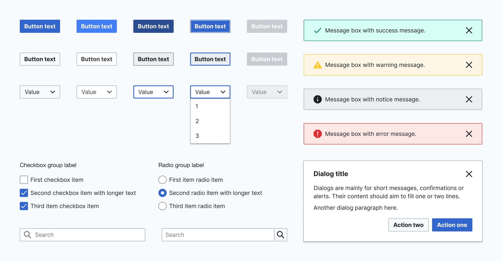
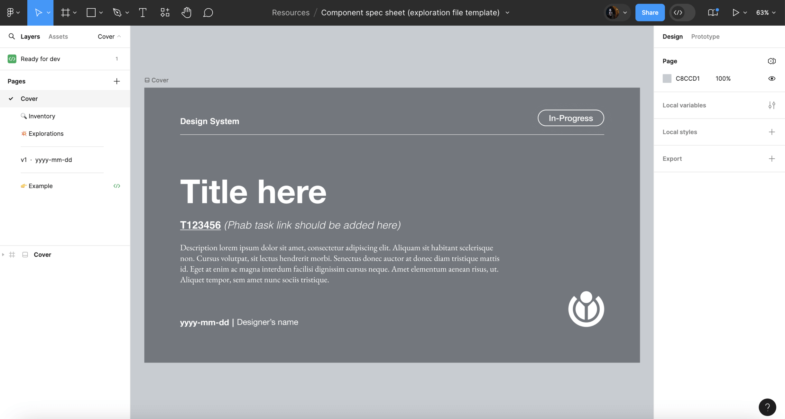
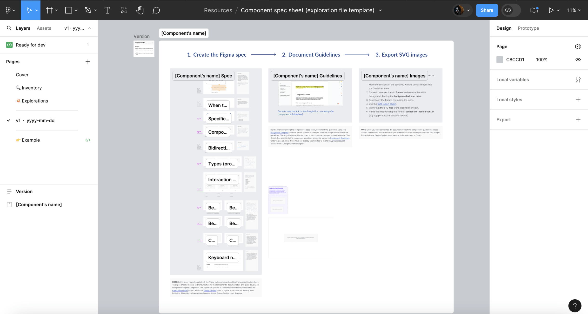
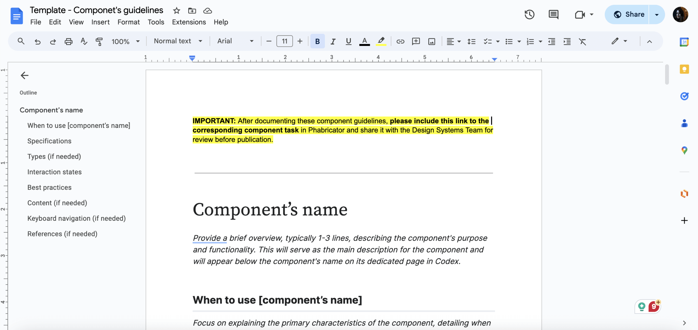

# Designing new components

This page outlines the steps that collaborators should follow in order to contribute a new Codex component.

## 1. Report and validate

### 1.1. Create a new component task

Once you have validated the need to create a fully new system component, the next step is filing the corresponding new component task in bug tracker Phabricator. Use this [new component task template][new-component-task-template] to create the task, and provide as much information as possible in the predefined sections.

This task will cover the history, use cases, and overall design of the new component, although only
a "minimum viable product" (MVP) version of the component will be built initially. Other tasks can
be opened to cover component features that will be implemented after the MVP.

### 1.2. Review the task with the Design System Team

The new component task must be reviewed with help from the Design System Team (DST) before the design process starts. This creates shared understanding of the use case and validates that the functionality can only be covered by a new component.

Make sure to add the [Design-System-Team](https://phabricator.wikimedia.org/project/profile/5858/) project tag to the task for visibility. You can also post a comment once the task has been created and ping the DST members as a way to start the conversation.

Once the task is validated with the DST and creating the new Codex component is agreed upon, you can start designing the new component.

## 2. Research and prepare

The designer in charge of creating the new system component should start by checking the following resources in order to collect relevant information and begin defining the new Codex component:

- [Codex component demos](../components/overview.md) and [Codex Figma library](https://www.figma.com/file/KoDuJMadWBXtsOtzGS4134/%E2%9D%96-Codex-components?node-id=1891%3A4420): verify whether the needed component has already been designed, or whether it can be designed based on or as a combination of any of the existing Codex elements
- [OOUI demo site](https://doc.wikimedia.org/oojs-ui/master/demos/?page=widgets&theme=wikimediaui&direction=ltr&platform=desktop) and [OOUI components Figma library](https://www.figma.com/file/2Jb1lVkhEMDFxO20I5xwyA/%E2%9D%96-OOUI-components?node-id=1891%3A4420&viewport=0%2C0%2C1): check if this component exists in the OOUI library, which is an important source of guidance for designers
- [Style guide](../style-guide/overview): understand the visual foundations of our Design System
- [Wikimedia web products](https://www.wikimedia.org/): detect current use cases of the component in the different Wikimedia products

Designers should start collecting, analyzing and comparing similar instances (either implemented or designed) of the new component: that is, components of the same category, or elements with shared characteristics that can influence the design direction.

This initial inventory-like process should allow designers to identify the visual building blocks of the new component, and help them understand its states and behavior in context.

## 3. Design the component

### 3.1. Create a new exploration file

Create a new Figma file to explore the different proposals and versions of the new component, so you can share them in the Phabricator task. You can duplicate this [component exploration template](https://www.figma.com/file/6hNSvvL4CoyfemXECihJD5/Exploration-File-(Template)?node-id=1%3A3627) to create your own file.

The following information will be included in the design exploration file:

- **Cover:** contains a title, description, Phabricator task link and the task owner.
- **Inventory:** collect and analyze the real use cases where the new component is needed.
- **Explorations** (optional): explore design options if needed before documenting the compponent in the Figma spec.
- **Component specifications**: document the component's specifications, including visual guides and component behaviors in this [specification sheet template](https://www.figma.com/design/6hNSvvL4CoyfemXECihJD5/Component-spec-sheet-(exploration-file-template)?node-id=0-1&node-type=canvas&viewport=532%2C205%2C0.12&t=tw154kTaud3hslBQ-0). Document all versions of the component on separate tabs, labeling each with the version (e.g. “v1”), date (e.g. “2022-07-17”), and an icon to indicate its status: final version (✅), archived (📁), or WIP (🛠).

### 3.2. Defining visual styles and interaction

The research phase should allow designers to identify the component’s behavior and building blocks. The information collected during that period should then be used to support the redefinition of the visual and interactive characteristics of said component, this time following the system’s design principles.

**Defining the component’s architecture**

It is essential to identify the new component’s architecture before diving deeper into defining its style and functionality. What are the building blocks or smaller elements that build up the component? Are these smaller elements components too? The answer to these questions can generate three scenarios:

1. The component is built as a combination of elements with their own styles, but exists as a single element (e.g. Button).

2. The component is built as a composite of different components that already exist (e.g. Combobox, which combines an input and a button).

3. The component is built as a composite of different components, one or more of which haven’t been designed or implemented yet (e.g. Card, which includes a Thumbnail component that requires its own specifications and implementation process).

The latter scenario will require you to follow the steps of the design process outlined in this section to **create each one of the individual building blocks** that make up the new component: each sub-component will require the same level of attention, its own exploration file and individual specification sheet. Sub-components will require **dedicated component tasks**, and also be added to the design components library separately.

#### Defining the component’s visual style

All system components should follow the visual guidelines defined in our [style guide](../style-guide/overview.html), as reflected by our design tokens, and use system iconography.

::: warning
You have to enable the [Codex Figma library](https://www.figma.com/design/KoDuJMadWBXtsOtzGS4134/Codex?node-id=1891-4420&node-type=canvas&t=plW1hmguHVWs3fWZ-11) in your Figma file to reuse Codex’s styles and icons. Learn more about [how to enable Figma libraries](https://help.figma.com/hc/en-us/articles/360038743434#access).
:::

Design tokens can help support the visual definition of components, as they represent pre-made, systematic stylistic decisions applied to specific properties. While designing new system components, keep in mind to reuse the Codex tokens created in Figma as styles and variables. If you need to use a token that is not documented yet, or you need to apply it in a different context of use, please notify the Design System Team.

Furthermore, components will need to consume only system assets:

- If you need to use iconography in your designs, use a [system icon](https://www.figma.com/design/KoDuJMadWBXtsOtzGS4134/Codex?node-id=20598-51338&node-type=canvas&t=plW1hmguHVWs3fWZ-11). If you need to use an icon that does not exist in our shared library yet, you can contribute the design of a new icon. Learn how to do this in the [Designing icons](./designing-icons.md) section.
- If you need to use a Wikimedia logo, use one from our [logo assets](https://www.figma.com/design/KoDuJMadWBXtsOtzGS4134/Codex?node-id=20598-51478&node-type=canvas&t=plW1hmguHVWs3fWZ-11).
- If you need to use an illustration, use one from our [illustration assets](https://www.figma.com/design/KoDuJMadWBXtsOtzGS4134/Codex?node-id=20598-51408&node-type=canvas&t=plW1hmguHVWs3fWZ-11) or create one with the same styles.

#### Defining the component’s interaction

In order to provide a consistent experience, the component’s behavior and interactive states should also follow the system’s design principles and patterns documented in the [Codex Figma library](https://www.figma.com/file/KoDuJMadWBXtsOtzGS4134/%E2%9D%96-Codex-components?node-id=1891%3A4420https://www.figma.com/file/KoDuJMadWBXtsOtzGS4134/%E2%9D%96-Codex-components?node-id=1891%3A4420). Keep in mind the recommendations provided in the specification sheets and the existing Codex components demo pages to make sure that the new component follows the existing standards.

The real use case learnings gathered during the Research and prepare phase should also deeply inform the definition of the new component’s interactive states.

When defining the interactive behavior of new system components, keep in mind to:

- Consider **internationalization** needs and make sure the component is optimized for the different languages and orientations. Refer to the [Bidirectionality guidelines](../style-guide/bidirectionality.md) for more details.
- Make sure to define the **responsive behavior** of the component, and to provide examples of its adaptation to different devices/ screen sizes. You should define the component for desktop, tablet landscape, tablet portrait and mobile.
- Research and follow **accessibility** best practices that apply to the typology of the component being defined, and provide keyboard navigation specifications. Read more about [accessibility principles and resources](../style-guide/accessibility.md).

### 3.3. Design the main component in Figma

Once you have enough information to design the initial version of the component, you’ll be ready to create the [main component](https://help.figma.com/hc/en-us/articles/360038662654-Guide-to-components-in-Figma) in the Figma exploration file. This will make it possible for other designers to reuse said component in different Figma projects. The main component will also be reused to illustrate the different sections of its specification sheet.

While creating the main component, make sure to:

- Create the [Figma variants](https://help.figma.com/hc/en-us/articles/360056440594-Create-and-use-variants) needed to represent the different states (default, hover, focus, disabled…) in all platforms (desktop, mobile).
- Define the [component properties](https://help.figma.com/hc/en-us/articles/5579474826519-Create-and-use-component-properties) of each variant so the designers can customize the variant, replace instances of other elements it may contain, set the content and use available boolean properties to adjust the component to their use case.
- Apply the right [auto layout](https://help.figma.com/hc/en-us/articles/5731482952599-Using-auto-layout) properties to make the component display the right resizing behavior and maintain the correct spacing whenever its contents are modified.
- Apply [constraints](https://help.figma.com/hc/en-us/articles/360039957734-Apply-constraints-to-define-how-layers-resize) to define how the component will behave when resized.

Figma provides extensive [resources](https://help.figma.com/hc/en-us) that will help you create flexible and robust components that are reliable and comfortable to reuse by the rest of the design team members. Count on the Design System Team to support you at any step of the process if you find any obstacles working with Figma.

### 3.4. Create the component’s specification sheet

Once the component’s visual style and interactive behavior have been defined in the main component, the component specification sheet will need to be created in order to document the component’s behavior. This spec sheet will serve as the foundation for the component's documentation and guide developers in implementing the component. You can use the [component specification sheet template](https://www.figma.com/file/6hNSvvL4CoyfemXECihJD5/Component-spec-sheet-(exploration-file-template)?node-id=501%3A22874) that’s available in the Figma exploration file.

The component specification sheet needs to contain the following sections:

1. **Guides:** This section will document the component’s specifications by including any relevant info for developers, such as paddings, sizes, tokens used, or any component used to create this component.
2. **When to use the component (e.g. "When to use accordions"):** Focus on explaining the primary characteristics of the component, detailing when and when not to use it. This section aims to guide users in making informed decisions about using the component within their projects.
3. **Specifications:** Define the component's anatomy using an image with arrows and numerical labels for each one of the component’s elements. The corresponding text will provide detailed explanations for each numbered element in the image, specifying which of those elements are optional and can be hidden within the component. Additionally, outline the component's minimum and maximum requirements, detailing length or element count constraints. Conclude this section with a link to the Figma spec sheet in the library.
4. **Component limitations:** This section will include the minimum and maximum requirements for this component, detailing length or element count constraints.
5. **Bidirectionality:** This section will document how the component will be mirrored for both LTR and RTL. Refer to the Bidirectionality guidelines for more information.
6. **Types** (if needed): Provide details for the different properties or variants of the component, accompanied by clear images representing each one. This section is applicable only to components offering custom properties or various variants.
7. **Interaction states:** Create an image illustrating all interaction states of the component, with each state numbered. A corresponding numbered list will be included below the image, providing names for each state. This section applies only to components with interactive states.
8. **Best practices:** Offer guidance on optimal usage for each component, including both do and don't images with practical examples. Illustrate how users might use the different component variants and properties effectively, and explain how the component can interact with other system elements like icons, colors, or other components.
9. **Content** (if needed): If the new component requires guidelines for content, such as recommended character count or writing recommendations, this section will provide clear instructions to do so. You can include Do and Don’t images for each recommendation.
10. **Keyboard navigation** (if needed): Incorporate keyboard navigation into a table, detailing the keys for interacting with the component via keyboard. This section will clarify how users can navigate the component using various keyboard shortcuts, and it applies only to components with interactive states.

::: info
The Figma file specific to the component should be moved to the [Explorations (WIP)](https://www.figma.com/files/1052664678635144083/project/44938429/Explorations-(WIP)?fuid=1291385767832101845) project within the [Design System](https://www.figma.com/files/1052664678635144083/team/1052677095198424468/Design-System?fuid=1042004517503209744) team in Figma. If you have not already been invited to this project, please request access from a Design System team designer.
:::

### 3.5. Evaluate and iterate

#### Collecting design feedback

Throughout the component design process, it is important to incorporate feedback from Wikimedia’s UX designers, specially from system designers, who will also grant final explicit approval on their proposed design and its specification before moving into the hand-off to development step.

Once the new component’s specification sheet has been defined in the design exploration file, it should be shared in the Phabricator task in order to collect feedback from the Design System Team, other designers and community members.

The component proposal will be discussed in Phabricator, and it will be iterated on if needed. All the open questions listed in the task and subsequent possible discussions will need to be solved before the design of the new component can be considered done.

::: warning
No component can be added to the system without being validated by the Design System Team first. The component designs will need to be reviewed with help from a system designer from the core team. Post a comment in the Phabricator task and ping them there so they can review the component and track the task.
:::

#### Collecting feedback from users

You can assess the need to test new components with help from users using your preferred methodology. This will validate to which degree the new element's behavior and features meet their expectations, and whether it supports them to accomplish the intended task.

A general recommendation is to test components in a realistic context that simulates the component’s most common interaction conditions: in combination with other components (e.g. test input fields in a form set up, create a search scenario to test search fields, etc.).

## 4. Define the guidelines

After completing the component specification sheet, duplicate this [Google Doc template](https://docs.google.com/document/d/1oVTtBk7ShOKj80dz3CYsd09sC9gBbfpbJ8M_E1zdm6c/edit#heading=h.a76x583bwhh3) to document the component’s guidelines.

Follow the sections outlined in the template to structure the guidelines, which will be added to the component's page on the Codex site. You can use the frames designed in the Figma spec sheet as images to illustrate these guidelines.

::: info
Move the Google Doc for the component guidelines to the [Component Guidelines](https://drive.google.com/drive/u/1/folders/1TMPY6YJzwUUO0vXaIpiEVoImsNeEiDRC) folder in Google Drive. If you don’t have access to this folder, please request it from a Design System designer.
:::

## 5. Hand-off to development

Once the component’s documentation has been discussed, iterated on (if needed) and finished, the designer will share the link to the final version of the design specification sheet and guidelines in the relevant component Phabricator task, so developers can start implementing the component in Codex.

The following actions are required:

1. **Link the design specification in the task:** the designer will add the link to the exploration file with the design specification sheet in the description of the Phabricator task.
2. **Post a comment:** in addition to link the specification sheet, the designer will post a comment explaining that the task is ready to be implemented, pinging the developer in that comment if possible.
3. **Move task in the board:** move the task to the next relevant column in the board to indicate that the component can be implemented in Codex (e.g. “Ready for development”).
4. **Complete the design checklist:** complete the design checklist in the “Acceptance criteria” section in the task description to indicate which steps in the task were already completed.

We recommend reviewing the component’s interactive and visual specifications with the help from the developers that will tackle its implementation as part of the hand-off step.

Engineers can help detect edge cases and identify potential technological constraints that should be considered during the design process.

## 6. Design sign-off

Once the component has been fully implemented in Codex, developers will assign the task to the component’s designer (and move the task to the corresponding column if existent) to perform a complete design review of the component.

The component will need to be tested against all its visual and functional specifications: states, properties, minimum and maximum examples, responsiveness, LTR and RTL, etc.

Once the design sign-off has been done, the designer will assign it to quality and test engineering (QTE) and move it to the corresponding QTE sign-off column, so quality assurance testing can be performed as a final check before release.

::: info
Designers will be able to check how components are coming along during the implementation process by accessing the Codex demo page staged in Netlify. Developers can provide links to the relevant Netlify build for you to provide feedback.
:::

## 7. Document: Add the new component to the Codex Figma library

Once the component has been implemented and signed-off, it will be ready to be added to the [Codex Figma library](https://www.figma.com/file/KoDuJMadWBXtsOtzGS4134/%E2%9D%96-Codex-components) so that it can be reused in the different design projects.

::: info
In order to avoid problems with our Figma library, designers from the Design System Team will be responsible for adding the new component to the library and for publishing it. Please ping them in the Phabricator task once the design exploration file is ready, so they can add the component in the Figma library.
:::

[new-component-task-template]: https://phabricator.wikimedia.org/maniphest/task/edit/form/1/?title=%5BComponentName%5D%3A%20Add%20%5BComponentName%5D%20component%20to%20Codex&description=%23%23%20Background%0D%0A%0D%0A%2F%2FNOTE%3A%20%20When%20creating%20a%20component%20task%2C%20please%20try%20to%20fill%20out%20the%20entire%20Background%20section.%20The%20rest%20of%20the%20task%20description%20can%20be%20populated%20later.%2F%2F%0D%0A%0D%0A%23%23%23%20Description%0D%0A%0D%0A%2F%2FAdd%20a%20brief%20description%20of%20this%20component%2F%2F%0D%0A%0D%0A%23%23%23%20User%20stories%0D%0A%0D%0A%2F%2FAdd%20at%20least%20one%20user%20story.%2F%2F%0D%0A%0D%0A%23%23%23%20History%0D%0A%0D%0A%2F%2FDescribe%20or%20link%20to%20prior%20discussions%20related%20to%20this%20component%2F%2F%0D%0A%0D%0A%23%23%23%20Known%20use%20cases%0D%0A%0D%0A%2F%2FDescribe%20known%20use%20cases%20for%20this%20component%2C%20including%20the%20project%2C%20team%2C%20and%20timeline%2F%2F%0D%0A%0D%0A%23%23%23%20Existing%20implementations%0D%0A%0D%0AThese%20artifacts%20are%20listed%20for%20historical%20context.%20The%20figma%20spec%2C%20linked%20below%2C%20is%20the%20source%20of%20truth%20for%20the%20new%20component.%0D%0A%0D%0A**Wikimedia%20community%3A**%0D%0A-%20**OOUI%3A**%20%2F%2Fadd%20the%20relevant%20OOUI%20widget%20name(s)%20here%2C%20if%20applicable.%20See%20%5B%5B%20https%3A%2F%2Fdoc.wikimedia.org%2Foojs-ui%2Fmaster%2Fdemos%2F%3Fpage%3Dwidgets%26theme%3Dwikimediaui%26direction%3Dltr%26platform%3Ddesktop%20%7C%20OOUI%20demos%20%5D%5D.%2F%2F%0D%0A-%20**Vue%3A**%20%2F%2Fadd%20any%20existing%20Vue%20implementations%2C%20if%20applicable.%20See%20%5B%5B%20https%3A%2F%2Fwww.mediawiki.org%2Fwiki%2FVue.js%23Projects_using_Vue.js%20%7C%20Projects%20using%20Vue.js%20%5D%5D.%2F%2F%0D%0A%0D%0A**External%20libraries%3A**%0D%0A-%20%2F%2FAdd%20links%20to%20any%20examples%20from%20external%20libraries%2F%2F%0D%0A%0D%0A---%0D%0A%0D%0A%23%23%20Codex%20implementation%0D%0A%0D%0A%23%23%23%20Component%20task%20owners%0D%0A%0D%0A-%20Designer%3A%20%2F%2Fadd%20the%20main%20designer%27s%20name%2F%2F%0D%0A-%20Developer%3A%20%2F%2Fadd%20the%20main%20developer%27s%20name%2F%2F%0D%0A%0D%0A%23%23%23%20Open%20questions%0D%0A%0D%0A-%20%2F%2FList%20any%20current%20open%20questions%20here%2F%2F%0D%0A%0D%0A%23%23%23%20Design%20spec%0D%0A%0D%0A%2F%2F%20Once%20a%20component%20spec%20sheet%20has%20been%20created%20in%20Figma%2C%20remove%20the%20note%20stating%20that%20the%20spec%20is%20missing%20and%20link%20to%20the%20spec%20below.%20%2F%2F%0D%0A%0D%0A%7C%20Component%20spec%20sheet%20%7C%0D%0A%0D%0A%23%23%23%23%20Anatomy%0D%0A%0D%0A%2F%2FDesigner%20should%20list%20the%20structure%20and%20properties%20of%20the%20component.%2F%2F%0D%0A%0D%0A%23%23%23%23%20Style%0D%0A%0D%0A%2F%2FDesigner%20should%20list%20the%20visual%20features%20of%20the%20component.%2F%2F%0D%0A%0D%0A%23%23%23%23%20Interaction%0D%0A%0D%0A%2F%2FDesigner%20should%20list%20interaction%20specifications.%2F%2F%0D%0A%0D%0A%23%23%23%23%20Guidelines%0D%0A%0D%0A%2F%2F%20Designer%20should%20provide%20the%20guidelines%20and%20associated%20images%20for%20this%20component.%20Once%20the%20guidelines%20have%20been%20documented%2C%20please%20remove%20this%20note%20and%20share%20a%20link%20to%20the%20guidelines%20below.%20%2F%2F%0D%0A%0D%0A%7C%20Doc%20with%20the%20guidelines%20%7C%20Images%20%7C%0D%0A%0D%0A%23%23%23%23%20Demos%0D%0A%0D%0A%2F%2FDesigner%20should%20describe%20how%20the%20component%20should%20be%20documented%20in%20the%20demos%2C%20including%20configurable%20and%20standalone%20demos.%2F%2F%0D%0A%0D%0A---%0D%0A%0D%0A%23%23%20Acceptance%20criteria%0D%0A%0D%0A%23%23%23%20Minimum%20viable%20product%0D%0A%0D%0AThis%20task%20covers%20the%20minimum%20viable%20product%20(MVP)%20version%20of%20this%20component.%20MVP%20includes%20basic%20layout%2C%20default%20states%2C%20and%20most%20important%20functionality.%0D%0A%0D%0A**MVP%20scope**%0D%0A-%20%5B%5D%20%2F%2FList%20all%20parts%20of%20the%20MVP%20scope%20for%20this%20component%2F%2F%0D%0A%0D%0A**Design**%0D%0A-%20%5B%5D%20Design%20the%20%5B%5B%20https%3A%2F%2Fdoc.wikimedia.org%2Fcodex%2Flatest%2Fcontributing%2Fdesigning-new-components.html%23_3-design-the-component%20%7C%20Figma%20exploration%20file%20%5D%5D%20and%20include%20its%20link%20in%20this%20task%3A%0D%0A%20%20%20-%20%5B%5D%20Make%20sure%20the%20Figma%20component%20is%20designed%20with%20all%20the%20required%20states%2C%20properties%2C%20and%20variants%2C%20including%20the%20%5B%5B%20https%3A%2F%2Fdoc.wikimedia.org%2Fcodex%2Flatest%2Fcontributing%2Fdesigning-new-components.html%23text-directionality-behavior%20%7C%20LTR%20and%20RTL%20%5D%5D%20versions%0D%0A%20%20%20-%20%5B%5D%20Make%20sure%20all%20colors%20used%20in%20the%20component%20follows%20the%20%5B%5B%20https%3A%2F%2Fwww.w3.org%2FWAI%2FWCAG21%2FUnderstanding%2Fcontrast-minimum.html%20%7C%20minimum%20required%20contrast%20%5D%5D%20to%20be%20accessible%0D%0A%20%20%20-%20%5B%5D%20Provide%20a%20thorough%20explanation%20of%20the%20component%27s%20behavior%20in%20the%20spec%20sheet%2C%20including%20all%20relevant%20specifications%2C%20maximum%20examples%2C%20and%20usage%20recommendations%0D%0A%20%20%20-%20%5B%5D%20Include%20a%20list%20of%20keyboard%20shortcuts%20to%20navigate%20the%20component%20%2F%2F(keyboard%20navigation%20table)%2F%2F%0D%0A-%20%5B%5D%20Document%20the%20component%27s%20guidelines%20and%20provide%20the%20link%20to%20the%20doc%20and%20its%20images%20in%20this%20task.%0D%0A-%20%5B%5D%20Publish%20the%20main%20component%20in%20the%20%5BFigma%20library%5D(https%3A%2F%2Fwww.figma.com%2Ffile%2FKoDuJMadWBXtsOtzGS4134%2F%25E2%259D%2596-Codex-components%3Fnode-id%3D1891%253A4420%26viewport%3D287%252C338%252C0.28).%20%2F%2FThis%20step%20will%20be%20done%20by%20a%20DST%20member.%2F%2F%0D%0A%0D%0A**Code**%0D%0A-%20%5B%5D%20Implement%20the%20component%20in%20Codex%0D%0A-%20%5B%5D%20Implement%20the%20guidelines%20in%20the%20component%27s%20page%0D%0A%0D%0A%23%23%23%20Future%20work%0D%0A%0D%0A-%20%2F%2FIf%20applicable%2C%20list%20future%20work%20that%20should%20be%20done%20for%20this%20component%20after%20the%20MVP%20is%20implemented%20as%20part%20of%20this%20task.%20You%20should%20open%20new%2C%20standalone%20tasks%20for%20all%20future%20work.%2F%2F&projects=Codex%2C%20Design-Systems-Team