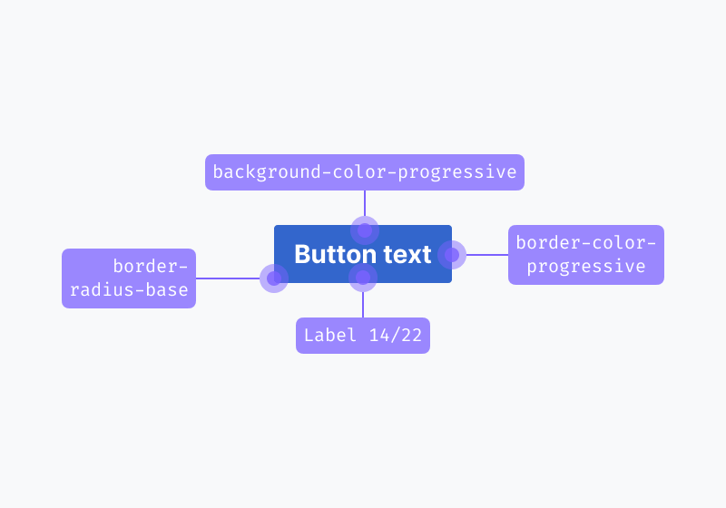
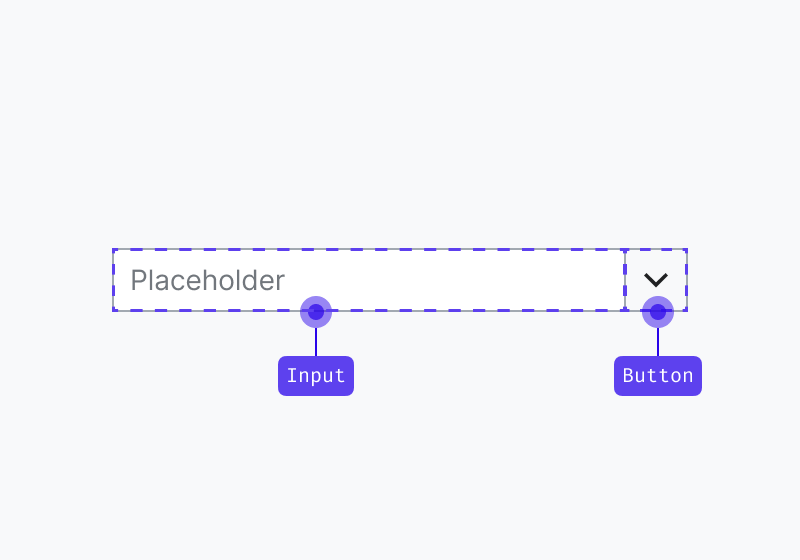
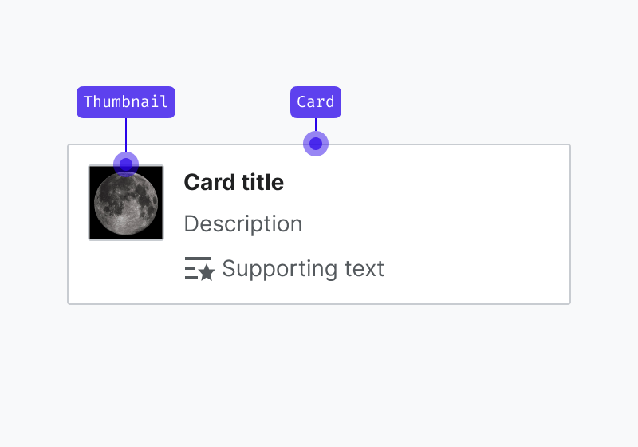
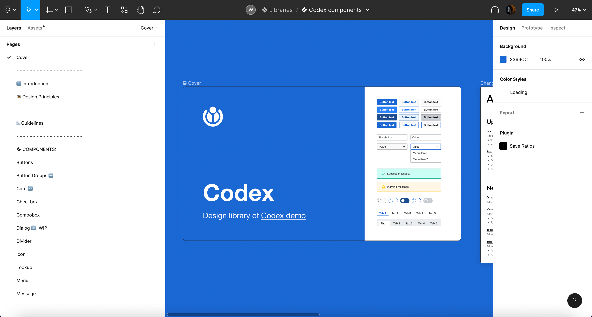

# Designing new components

This page outlines the steps that collaborators should follow in order to contribute a new Codex component.

## 1. Report and validate

### 1.1. Create a new component task

Once you have validated the need to create a fully new system component, the next step is filing the corresponding new component task in bug tracker Phabricator. Use this [new component task template][new-component-phab-template] to create the task, and provide as much information as possible in the predefined sections.

This task will cover the history, use cases, and overall design of the new component, although only
a "minimum viable product" (MVP) version of the component will be built initially. Other tasks can
be opened to cover component features that will be implemented after the MVP.

### 1.2. Review the task with the Design Systems Team

The new component task must be reviewed with help from the Design Systems Team (DST) before the design process starts. This creates shared understanding of the use case and validates that the functionality can only be covered by a new component.

Make sure to add the [Design-Systems-Team](https://phabricator.wikimedia.org/project/profile/5858/) project tag to the task for visibility. You can also post a comment once the task has been created and ping the DST members as a way to start the conversation.

Once the task is validated with the DST and creating the new Codex component is agreed upon, you can start designing the new component.

## 2. Research and prepare

The designer in charge of creating the new system component should start by checking the following resources in order to collect relevant information and begin defining the new Codex component:

- [Codex component demos](../components/overview.md) and [Codex components Figma library](https://www.figma.com/file/KoDuJMadWBXtsOtzGS4134/%E2%9D%96-Codex-components?node-id=1891%3A4420): verify whether the needed component has already been designed, or whether it can be designed based on or as a combination of any of the existing Codex elements
- [OOUI demo site](https://doc.wikimedia.org/oojs-ui/master/demos/?page=widgets&theme=wikimediaui&direction=ltr&platform=desktop) and [OOUI components Figma library](https://www.figma.com/file/2Jb1lVkhEMDFxO20I5xwyA/%E2%9D%96-OOUI-components?node-id=1891%3A4420&viewport=0%2C0%2C1): see if this component exists in the OOUI library, which is an important source of guidance for designers
- [Style guide](../style-guide/overview): understand the visual foundations of our Design System
- [Wikimedia web products](https://www.wikimedia.org/): detect current use cases of the component in the different Wikimedia products

Designers should start collecting, analyzing and comparing similar instances (either implemented or designed) of the new component: that is, components of the same category, or elements with shared characteristics that can influence the design direction.

This initial inventory-like process should allow designers to identify the visual building blocks of the new component, and help them understand its states and behavior in context.

## 3. Design the component

### 3.1. Create a new exploration file

Create a new Figma file to explore the different proposals and versions of the new component, so you can share them in the Phabricator task. You can duplicate this [component exploration template](https://www.figma.com/file/6hNSvvL4CoyfemXECihJD5/Exploration-File-(Template)?node-id=1%3A3627) to create your own file.

The following information will be included in the design exploration file:

- **Cover:** contains a title, description, Phabricator task link and the task owner.
- **Inventory** *(optional):* collect and analyze the real use cases where the new component is needed.
- **Component specifications**: collect the most relevant component specifications, from visual guides to use cases and RTL version in this [specification sheet template](https://www.figma.com/file/6hNSvvL4CoyfemXECihJD5/Component-spec-sheet-(exploration-file-template)?node-id=501%3A22874&viewport=532%2C205%2C0.12).
- **Versioning:** create a new Figma page to document every new version of the component specifications. Indicate the version (e.g. “v1”) and date (e.g. “2022-07-17”) and add an icon to indicate if the version is the final (✅), archived (📁) or WIP (🛠).

### 3.2. Defining visual styles and interaction

The research phase should allow designers to identify the component’s behavior and building blocks. The information collected during that period should then be used to support the redefinition of the visual and interactive characteristics of said component, this time following the system’s design principles.

**Defining the component’s architecture**

It is essential to identify the new component’s architecture before diving deeper into defining its style and functionality. What are the building blocks or smaller elements that build up the component? Are these smaller elements components too? The answer to these questions can generate three scenarios:

1. The component is built as a combination of elements with their own styles, but exists as a single element (e.g. Button)

2. The component is built as a composite of different components that already exist (e.g. Combobox, which combines an input and a button)

3. The component is built as a composite of different components, one or more of which haven’t been designed or implemented yet (e.g. Card, which includes a subcomponent – Thumbnail – that requires its own specifications and implementation process )

The latter scenario will require you to follow the steps of the design process outlined in this section to **create each one of the individual building blocks** that make up the new component: each subcomponent will require the same level of attention, its own exploration file and individual specification sheet. Subcomponents will require **dedicated component tasks**, and also be added to the design components library separately.

#### Defining the component’s visual style

All system components should follow the visual guidelines defined in our [style guide](../style-guide/overview.html), as reflected by our design tokens, and use system iconography.

Here are some resources you can check to find Codex’s design tokens and icons:

- **Design Tokens:** [Figma library](https://www.figma.com/file/mRvSsFD2Kwh8AZNjlx7rIl/%E2%9C%A8-Design-Tokens-%5BWIP%5D?node-id=0%3A1) | [Codex demo](../design-tokens/overview.html)
- **Assets** (Iconography, Logos, Illustrations)**:** [Figma library](https://www.figma.com/file/1lT9LKOK6wiHLnpraMjP3E/%E2%9D%96-Icon-System) | [Codex demo](../icons/all-icons.html)

::: warning
You have to enable both the [Design Tokens](https://www.figma.com/file/mRvSsFD2Kwh8AZNjlx7rIl/%E2%9C%A8-Design-Tokens-%5BWIP%5D?node-id=0%3A1&viewport=466%2C353%2C0.07) and the [Assets](https://www.figma.com/file/1lT9LKOK6wiHLnpraMjP3E/%E2%9D%96-Icon-System) libraries in your Figma exploration file in order to be able to reuse Codex’s styles and icons. Learn more about [how to access libraries](https://help.figma.com/hc/en-us/articles/360038743434#access) in Figma.
:::

Design tokens can help support the visual definition of components, as they represent pre-made, systematic stylistic decisions applied to specific properties. While designing new system components, keep in mind to:

- Only use colors from the [**color decisions**](https://www.figma.com/file/mRvSsFD2Kwh8AZNjlx7rIl/%E2%9C%A8-Design-Tokens-%5BWIP%5D?node-id=902%3A3415&t=vLBtIEtZXpfb8dlA-11) defined in our system, and only apply them in their specific context of use (e.g. use only border colors to style borders). If you need to use a color that is not documented in the color decisions’ palette, or you need to apply it in a different context of use, please notify the Design Systems Team.
- Only use system [**text/font styles**](https://www.figma.com/file/mRvSsFD2Kwh8AZNjlx7rIl/%E2%9C%A8-Design-Tokens-%5BWIP%5D?node-id=1%3A3484).
- Follow the [**size & spacing**](https://www.figma.com/file/mRvSsFD2Kwh8AZNjlx7rIl/%E2%9C%A8-Design-Tokens-%5BWIP%5D?node-id=1%3A3487) to define the **spacing** (e.g. paddings & margins) and **size** (e.g. heights & widths) of components and their elements.
- Use the [**grid & layout**](https://www.figma.com/file/mRvSsFD2Kwh8AZNjlx7rIl/%E2%9C%A8-Design-Tokens-%5BWIP%5D?node-id=2%3A2410) defined in our system, and provide responsive versions of the component adjusted to said grids in the component specification sheet.
- If you need to apply shadows in your design, use only the [**shadow styles**](https://www.figma.com/file/mRvSsFD2Kwh8AZNjlx7rIl/%E2%9C%A8-Design-Tokens-%5BWIP%5D?node-id=1%3A3485) created in our system and documented as "effect styles" in Figma.
- Always use the same [**border radius, width and style**](https://www.figma.com/file/mRvSsFD2Kwh8AZNjlx7rIl/%E2%9C%A8-Design-Tokens-%5BWIP%5D?node-id=1%3A3482) defined in our tokens

Furthermore, components will need to consume only system assets:

- If you need to use iconography in your designs, use a [system icon](https://www.figma.com/file/1lT9LKOK6wiHLnpraMjP3E/%E2%9D%96-Icon-System?node-id=0%3A1). If you need to use an icon that does not exist in our shared library yet, you can contribute the design of a new icon. (Learn how to do this in the [Designing icons](./designing-icons.md) section).
- If you need to use a Wikimedia logo, please use one from our [logo assets](https://www.figma.com/file/1lT9LKOK6wiHLnpraMjP3E/%E2%9D%96-Assets-(Icons%2C-Logos%2C-Illustrations)?node-id=2285%3A3747&viewport=993%2C62%2C0.32).
- If you need to use an illustration, please use one from our [illustration assets](https://www.figma.com/file/1lT9LKOK6wiHLnpraMjP3E/%E2%9D%96-Assets-(Icons%2C-Logos%2C-Illustrations)?node-id=3232%3A669&viewport=1267%2C-111%2C0.1) or create one with the same styles.

#### Defining the component’s interaction

In order to provide a consistent experience, the component’s behavior and interactive states should also follow the system’s design principles and patterns documented in the [Codex library](https://www.figma.com/file/KoDuJMadWBXtsOtzGS4134/%E2%9D%96-Codex-components?node-id=1891%3A4420https://www.figma.com/file/KoDuJMadWBXtsOtzGS4134/%E2%9D%96-Codex-components?node-id=1891%3A4420). Keep in mind the recommendations provided in the specification sheets and the existing Codex components demo pages to make sure that the new component follows the existing standards.

The real use case learnings gathered during the Research and prepare phase should also deeply inform the definition of the new component’s interactive states.

When defining the interactive behavior of new system components, keep in mind to:

- Consider **internationalization** needs and make sure that the component is optimized for the different languages and orientations (learn more about [designing for bi-directionality](https://www.figma.com/file/KoDuJMadWBXtsOtzGS4134/%E2%9D%96-Codex-components?node-id=3149%3A46886)).
- Make sure to define the **responsive behavior** of the component, and to provide examples of its adaptation to different devices/ screen sizes. You should define the component for desktop, tablet landscape, tablet portrait and mobile.
- Research and follow **accessibility** best practices that apply to the typology of the component being defined, and provide keyboard navigation specs. Read more about [accessibility principles and resources](https://design.wikimedia.org/style-guide/design-principles_accessibility.html).

### 3.3. Design the main component in Figma

Once you have enough information to design the initial version of the component, you’ll be ready to create the [main component](https://help.figma.com/hc/en-us/articles/360038662654-Guide-to-components-in-Figma) in the Figma exploration file. This will make it possible for other designers to reuse said component in different Figma projects. The main component will also be reused to illustrate the different sections of its specification sheet.

While creating the main component, make sure to:

- Create the [Figma variants](https://help.figma.com/hc/en-us/articles/360056440594-Create-and-use-variants) needed to represent the different states (default, hover, focus, disabled…) in all platforms (desktop, mobile).
- Define the [component properties](https://help.figma.com/hc/en-us/articles/5579474826519-Create-and-use-component-properties) of each variant so the designers can customize the variant, replace instances of other elements it may contain, set the content and use available boolean properties to adjust the component to their use case.
- Apply the right [auto layout](https://help.figma.com/hc/en-us/articles/5731482952599-Using-auto-layout) properties to make the component display the right resizing behavior and maintain the correct spacing whenever its contents are modified.
- Apply [constraints](https://help.figma.com/hc/en-us/articles/360039957734-Apply-constraints-to-define-how-layers-resize) to define how the component will behave when resized.

Figma provides extensive [resources](https://help.figma.com/hc/en-us) that will help you create flexible and robust components that are reliable and comfortable to reuse by the rest of the design team members. Count on the Design Systems Team to support you at any step of the process if you find any obstacles working with Figma.

### 3.4. Create the component’s specification sheet

Once the component’s visual style and interactive behavior have been defined in the main component, the component spec sheet will need to be created in order to document the component’s behavior. You can use the [component spec sheet template](https://www.figma.com/file/6hNSvvL4CoyfemXECihJD5/Component-spec-sheet-(exploration-file-template)?node-id=501%3A22874) that’s available in the Figma exploration file.

The component spec sheet needs to contain the following sections:

#### Guides

This segments collects specs that indicate which styles and building blocks make up the new system element. You can use size and spacer components, and the documentation bubbles to pinpoint specific values of the component’s properties (e.g. typography) and its anatomy (e.g. if it contains other components):

#### Component properties

This section will document the different configurations of the component (its properties, such as whether it presents icons) or its different functional variants. Component properties should be described in a simple and direct way.

#### States

The *States* section is one of the most relevant parts of a component’s specifications. It should document the visual properties that a given component presents in each one of its possible interaction states. The states of all the individual component variants (if present) should be showcased here too.

Some of the most common states in components are: Default, Hover, Focus and/or Active, Loading, and Disabled. But not all components will necessarily display all these states; keep in mind the use cases and standard behavior of the individual component or variant when documenting their states.

#### Minimum and maximum examples

This section showcases how the component will adjust when its content is reduced to the minimum or increased to the maximum. This section is very important for developers to understand the component’s behavior, and how certain elements should be aligned or positioned in case resizing is necessary.

#### Use cases

This section contains usage recommendations in the form of *Do* and *Don’t* examples. This content will be particularly useful for designers to understand how the component should be used in their designs.

#### Text directionality behavior

Document the left-to-right (LTR) and right-to-left (RTL) versions of the component beside each other in this section. This makes it easy to understand the changes in orientation that each version needs to display depending on the directionality of the UI language. Learn more about how to design components for [bi-directionality](https://www.figma.com/file/KoDuJMadWBXtsOtzGS4134/%E2%9D%96-Codex-components?node-id=3149%3A46886).

#### Keyboard navigation

This section needs to include a table that specifies all keys that can be used to interact with the component using a keyboard. These specifications are critical to providing full accessibility.

For guidance, you can check the [ARIA Authoring Practices Guide](https://www.w3.org/WAI/ARIA/apg/patterns/), which contains recommendations and live component examples.

#### Responsive behavior

This section need will showcase the component’s responsive behavior in the following screen sizes:

- **Desktop** (1440px screen size)
- **Tablet landscape** (1024px screen size)
- **Tablet portrait** (768px screen size)
- **Mobile** (320px screen size)

*This section should only be provided in case the component displays a responsive behavior. If the component doesn’t need to be adjusted to different viewport widths (e.g. icon, thumbnail) then the Responsive behaviors section can be hidden.*

### 3.5. Evaluate and iterate

#### Collecting design feedback

Throughout the component design process, it is important to incorporate feedback from Wikimedia’s UX designers, specially from system designers, who will also grant final explicit approval on their proposed design and its specification before moving into the hand-off to development step.

Once the new component’s specification sheet has been defined in the design exploration file, it should be shared in the Phabricator task in order to collect feedback from the Design Systems Team, other designers and community members.

The component proposal will be discussed in Phabricator, and it will be iterated on if needed. All the open questions listed in the task and subsequent possible discussions will need to be solved before the design of the new component can be considered done.

::: warning
No component can be added to the system without being validated by the Design Systems Team first. The component designs will need to be reviewed with help from a system designer from the core team. Post a comment in the Phabricator task and ping them there so they can review the component and track the task.
:::

#### Collecting feedback from users

You can assess the need to test new components with help from users using your preferred methodology. This will validate to which degree the new element's behavior and features meet their expectations, and whether it supports them to accomplish the intended task.

A general recommendation is to test components in a realistic context that simulates the component’s most common interaction conditions: in combination with other components (e.g. test input fields in a form set up, create a search scenario to test search fields, etc.).

## 4. Hand-off to development

Once the component’s design has been discussed, iterated on (if needed) and finished, the designer will share the link to the final version of the design spec sheet in the relevant component Phabricator task, so developers can start implementing the component in Codex.

The following actions are required:

1. **Link the design spec in the task:** the designer will add the link to the exploration file with the design spec sheet in the description of the Phabricator task.
2. **Post a comment:** in addition to link the spec sheet, the designer will post a comment explaining that the task is ready to be implemented, pinging the developer in that comment if possible.
3. **Move task in the board:** move the task to the next relevant column in the board to indicate that the component can be implemented in Codex (e.g. “Ready for development”).
4. **Complete the design checklist:** complete the design checklist in the “Acceptance criteria” section in the task description to indicate which steps in the task were already completed.

We recommend reviewing the component’s interactive and visual specs with the help from the developers that will tackle its implementation as part of the hand-off step.

Engineers can help detect edge cases and identify potential technological constraints that should be considered during the design process.

## 5. Design sign-off

Once the component has been fully implemented in Codex, developers will assign the task to the component’s designer (and move the task to the corresponding column if existent) to perform a complete design review of the component.

The component will need to be tested against all its visual and functional specifications: states, properties, minimum and maximum examples, responsiveness, LTR and RTL, etc.

Once the design sign-off has been done, the designer will assign it to quality and test engineering (QTE) and move it to the corresponding QTE sign-off column, so quality assurance testing can be performed as a final check before release.

::: info
Designers will be able to check how components are coming along during the implementation process by accessing the Codex demo page staged in Netlify. Developers can provide links to the relevant Netlify build for you to provide feedback.
:::

## 6. Document: Add the new component to the Figma library

Once the component has been implemented and signed-off, it will be ready to be added to the [Codex components Figma library](https://www.figma.com/file/KoDuJMadWBXtsOtzGS4134/%E2%9D%96-Codex-components) so that it can be reused in the different design projects.

::: info
In order to avoid problems with current components and instances, system designers will be responsible for adding the new component to the library and for publishing a new version of it. Please ping them in the component’s Phabricator task and share the design exploration file with them so they can add the component to the [Codex components Figma library](https://www.figma.com/file/KoDuJMadWBXtsOtzGS4134/%E2%9D%96-Codex-components?node-id=1891%3A4420).
:::

[new-component-phab-template]: https://phabricator.wikimedia.org/maniphest/task/edit/form/1/?title=%5BComponentName%5D%3A%20Add%20%5BComponentName%5D%20component%20to%20Codex&description=%23%23%20Background%0D%0A%0D%0A%2F%2FNOTE%3A%20%20When%20creating%20a%20component%20task%2C%20please%20try%20to%20fill%20out%20the%20entire%20Background%20section.%20The%20rest%20of%20the%20task%20description%20can%20be%20populated%20later.%2F%2F%0D%0A%0D%0A%23%23%23%20Description%0D%0A%0D%0A%2F%2FAdd%20a%20brief%20description%20of%20this%20component%2F%2F%0D%0A%0D%0A%23%23%23%20User%20stories%0D%0A%0D%0A%2F%2FAdd%20at%20least%20one%20user%20story.%2F%2F%0D%0A%0D%0A%23%23%23%20History%0D%0A%0D%0A%2F%2FDescribe%20or%20link%20to%20prior%20discussions%20related%20to%20this%20component%2F%2F%0D%0A%0D%0A%23%23%23%20Known%20use%20cases%0D%0A%0D%0A%2F%2FDescribe%20known%20use%20cases%20for%20this%20component%2C%20including%20the%20project%2C%20team%2C%20and%20timeline%2F%2F%0D%0A%0D%0A%23%23%23%20Existing%20implementations%0D%0A%0D%0AThese%20artifacts%20are%20listed%20for%20historical%20context.%20The%20figma%20spec%2C%20linked%20below%2C%20is%20the%20source%20of%20truth%20for%20the%20new%20component.%0D%0A%0D%0A**Wikimedia%20community%3A**%0D%0A-%20**Design%20style%20guide%3A**%20%2F%2Fadd%20%5B%5B%20https%3A%2F%2Fdesign.wikimedia.org%2Fstyle-guide%2Findex.html%20%7C%20Design%20Style%20Guide%20%5D%5D%20link%2C%20if%20applicable%2F%2F%0D%0A-%20**OOUI%3A**%20%2F%2Fadd%20the%20relevant%20OOUI%20widget%20name(s)%20here%2C%20if%20applicable.%20See%20%5B%5B%20https%3A%2F%2Fdoc.wikimedia.org%2Foojs-ui%2Fmaster%2Fdemos%2F%3Fpage%3Dwidgets%26theme%3Dwikimediaui%26direction%3Dltr%26platform%3Ddesktop%20%7C%20OOUI%20demos%20%5D%5D.%2F%2F%0D%0A-%20**Vue%3A**%20%2F%2Fadd%20any%20existing%20Vue%20implementations%2C%20if%20applicable.%20See%20%5B%5B%20https%3A%2F%2Fwww.mediawiki.org%2Fwiki%2FVue.js%23Projects_using_Vue.js%20%7C%20Projects%20using%20Vue.js%20%5D%5D.%2F%2F%0D%0A%0D%0A**External%20libraries%3A**%0D%0A-%20%2F%2FAdd%20links%20to%20any%20examples%20from%20external%20libraries%2F%2F%0D%0A%0D%0A---%0D%0A%0D%0A%23%23%20Codex%20implementation%0D%0A%0D%0A%23%23%23%20Component%20task%20owners%0D%0A%0D%0A-%20Designer%3A%20%2F%2Fadd%20the%20main%20designer's%20name%2F%2F%0D%0A-%20Developer%3A%20%2F%2Fadd%20the%20main%20developer's%20name%2F%2F%0D%0A%0D%0A%23%23%23%20Open%20questions%0D%0A%0D%0A-%20%2F%2FList%20any%20current%20open%20questions%20here%2F%2F%0D%0A%0D%0A%23%23%23%20Design%20spec%0D%0A%0D%0A%2F%2F%20Once%20a%20component%20spec%20sheet%20has%20been%20created%20in%20Figma%2C%20remove%20the%20note%20stating%20that%20the%20spec%20is%20missing%20and%20link%20to%20the%20spec%20below.%20%2F%2F%0D%0A%0D%0AA%20component%20spec%20sheet%20has%20not%20been%20created%20yet.%0D%0A%0D%0A%7C%20Component%20spec%20sheet%20%7C%0D%0A%0D%0A%23%23%23%23%20Anatomy%0D%0A%0D%0A%2F%2FDesigner%20should%20list%20the%20structure%20and%20properties%20of%20the%20component.%2F%2F%0D%0A%0D%0A%23%23%23%23%20Style%0D%0A%0D%0A%2F%2FDesigner%20should%20list%20the%20visual%20features%20of%20the%20component.%2F%2F%0D%0A%0D%0A%23%23%23%23%20Interaction%0D%0A%0D%0A%2F%2FDesigner%20should%20list%20interaction%20specifications.%2F%2F%0D%0A%0D%0A%23%23%23%23%20Documentation%0D%0A%0D%0A%2F%2FDesigner%20should%20describe%20how%20the%20component%20should%20be%20documented%2C%20including%20configurable%20and%20standalone%20demos.%2F%2F%0D%0A%0D%0A---%0D%0A%0D%0A%23%23%20Acceptance%20criteria%0D%0A%0D%0A%23%23%23%20Minimum%20viable%20product%0D%0A%0D%0AThis%20task%20covers%20the%20minimum%20viable%20product%20(MVP)%20version%20of%20this%20component.%20MVP%20includes%20basic%20layout%2C%20default%20states%2C%20and%20most%20important%20functionality.%0D%0A%0D%0A**MVP%20scope**%0D%0A-%20%5B%5D%20%2F%2FList%20all%20parts%20of%20the%20MVP%20scope%20for%20this%20component%2F%2F%0D%0A%0D%0A**Design**%0D%0A-%20%5B%5D%20Design%20the%20Figma%20spec%20sheet%20and%20add%20a%20link%20to%20it%20in%20this%20task%0D%0A-%20%5B%5D%20Update%20the%20component%20in%20the%20%5BFigma%20library%5D(https%3A%2F%2Fwww.figma.com%2Ffile%2FKoDuJMadWBXtsOtzGS4134%2F%25E2%259D%2596-Codex-components%3Fnode-id%3D1891%253A4420%26viewport%3D287%252C338%252C0.28).%20%2F%2FThis%20step%20will%20be%20done%20by%20a%20DST%20member.%2F%2F%0D%0A%0D%0A**Code**%0D%0A-%20%5B%5D%20Implement%20the%20component%20in%20Codex%0D%0A%0D%0A%23%23%23%20Future%20work%0D%0A%0D%0A-%20%2F%2FIf%20applicable%2C%20list%20future%20work%20that%20should%20be%20done%20for%20this%20component%20after%20the%20MVP%20is%20implemented%20as%20part%20of%20this%20task.%20You%20should%20open%20new%2C%20standalone%20tasks%20for%20all%20future%20work.%2F%2F&projects=Codex
