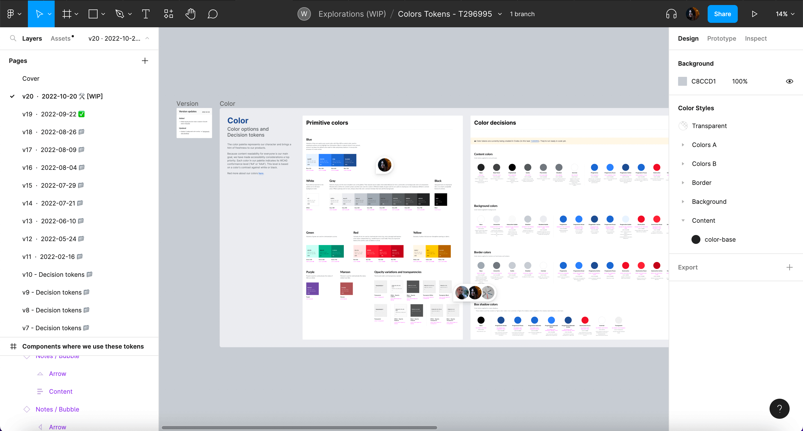
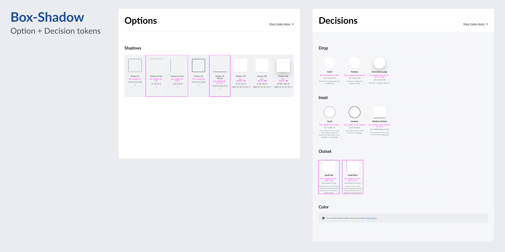
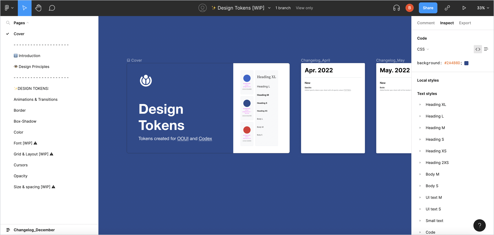

# Designing tokens

This page outlines the steps that collaborators should follow to contribute a new Codex design token.

::: info
Token creation is a complex design process since we need to fit the token in our current token scale and nomenclature. Design System Teams members will support you in the creation of the token and the proposals review.
:::

## 1. Report and validate

### 1.1. Create a new task in Phabricator

If none of the [existing Codex design tokens](../design-tokens/overview.md) provide the right value for a visual style, or if the initial intended use case of a token doesn’t match a new styling need, then a new token needs to be created.

The first step to include a new token in the system is to create a new Phabricator task. Use [this token creation task template][token-creation-task-template] to create the token ticket, filling in as much information as possible in the predefined sections.

::: tip
Designers can temporarily apply specific hard-coded values as placeholders in their designs until the reusable token is ready to use.
:::

### 1.2. Review the task with the Design System Team

The new task must be reviewed with help from the Design System Team (DST) before the token creation process starts. This is in order to validate that this new token is really needed, and to plan next steps. Make sure to add the [Design-System-Team](https://phabricator.wikimedia.org/project/profile/5858/) project tag to the task for visibility. You can also post a comment in the task and ping the DST members as a way to start the conversation.

Once the task is validated with the DST and the need is clear, you’ll be able to start designing the new system token.

## 2. Research and prepare

Designers should start by checking the following resources in order to collect relevant information about the existing tokens and their current use cases:

- [Design tokens library](https://www.figma.com/file/mRvSsFD2Kwh8AZNjlx7rIl/%E2%9C%A8-Design-Tokens-%5BWIP%5D?node-id=0%3A1&viewport=336%2C242%2C0.26): check the current tokens and styles in Figma.
- [Design tokens demo](../design-tokens/overview.md): check the current existing tokens in the Codex demo.
- [Wikimedia web products](https://www.wikimedia.org/): understand the Wikimedia products and their current styles.

Designers will start creating an initial inventory with the relevant use cases where this new token will be used. This process allows designers to understand the extent to which the new token will be reused. Also, tokens within the same category will need to be observed: the new token will have to fit into the existing scale.

## 3. Design the token

### 3.1. Work on the existing Figma exploration file

Work on your new token proposal using a Figma exploration file. This way, you’ll also be able to share your iterative designs in the relevant Phabricator task. If the token belongs into one of the existing categories, you’ll be able to reuse the available Figma exploration files:

- [Animation & Transition](https://www.figma.com/file/UNAWyVXbcioeVPCiCHhbh8/Motion-tokens---T304443)
- [Border](https://www.figma.com/file/PqH1gxenUEtB6Kw9vlwISW/Border-Tokens---T300562)
- [Box-shadow](https://www.figma.com/file/4cXXU5YqFnDqrMRefj3K89/Shadows-Tokens---T297003)
- [Breakpoint](https://www.figma.com/file/AH1Vtfc2PpjBdzZeyaIc8x/Breakpoints---T303522)
- [Color](https://www.figma.com/file/E6hxGwEOs9YFVF4fFRyqSv/Colors-Tokens---T296995)
- [Cursor](https://www.figma.com/file/z5oKZ1rsAFu9fQxGN4oArU/Cursor-Tokens---T302181)
- [Opacity](https://www.figma.com/file/h9pA2CCl2i0wtlTKNChaES/Opacities---Tokens)
- [Size & Spacing](https://www.figma.com/file/hcCHhevNA5aHo2D1Gajydc/Size-%26-spacing---Tokens)
- [Font](https://www.figma.com/file/X8pKlndyPaqZg4I3GubQs6/Font)

In the exploration Figma file, create a new Figma tab for each new token proposal you explore. Please indicate the version (e.g. “v1”) and date (e.g. “2022-07-17”), and add an icon to point out whether the version is final (✅), archived (📁) or work-in-progress (🛠 WIP).

### 3.2. Create option and decision tokens

Designers will need to add both option and decision tokens in their respective specifications sheets. Option tokens consume “raw” values (e.g. `#36c`), and usually have more abstract names (e.g. Blue 500). The names of decision tokens should express their intended use (e.g. content-progressive). They consume option tokens as values. Learn more about the different [token typologies](../design-tokens/definition-and-structure.md).

Make sure that both option and decision tokens fit within the existing value scale. Apply the value of the token to its “swatch” in Figma in order to showcase the new style. Also, make sure to use the right naming, which might depend on the token’s category.

### 3.4. Evaluate and iterate

Once the token’s specification sheet has been updated to include the new suggested token, it should be shared in the relevant Phabricator task, in order to start collecting feedback from the Design System Team, other designers, or the wider community.

The proposal will be discussed in the task and will be iterated if needed. All the potential open questions listed in the task will need to be resolved before the token’s design process can be considered done.

::: warning
No token can be added to the system without the approval of the Design System Team. Ping the team in the Phabricator task so they can review it and track the task.
:::

## 4. Hand-off to development

Once the token’s proposal has been discussed, iterated on (if needed) and finished, the designer will share the link to the final version of the token’s spec sheet in Phabricator task. At that point, developers will be able to start implementing the new token in Codex.

The following actions are required before handover:

1. **Link the design spec in the task:** the designer will add the link to the exploration file in the description of the Phabricator task.
2. **Post a comment:** leave a comment explaining that the task is ready to be implemented, pinging the developer in charge of including the token in the system if possible.
3. **Move the task to the next relevant column:** the task should be moved to the next relevant column in the board in order to indicate that the token is ready to be implemented in Codex.
4. **Complete the design checklist:** the designer will complete the design checklist in the “Acceptance criteria” section in the task description in order to reflect which steps in the task were already completed.

## 5. Design sign-off

Once the token has been implemented in Codex, developers will assign the task back to the token’s designer (and move the task to the corresponding column in the Phabricator board). Designers should then make sure that the token’s value and nomenclature were successfully created in Codex, and that it was applied correctly to the right components’ styles (if necessary).

::: info
Designers will be able to check the work-in-progress token’s demo by accessing the Codex demo page staged in Netlify. Developers will provide a link to the relevant Netlify build. Keep in mind that only the decision tokens will be visible in the Codex demo, but you can also verify the option tokens in the corresponding Gerrit patch.
:::

Once design sign-off is completed, the designer will move the task to the next column in the Phabricator board, so it can ultimately be considered for release.

## 6. Document: Create the new token as Figma style

Once the token has been implemented and signed-off, it will be created as a Figma style in the [Design tokens library](https://www.figma.com/file/mRvSsFD2Kwh8AZNjlx7rIl/%E2%9C%A8-Design-Tokens-%5BWIP%5D?node-id=0%3A1&viewport=320%2C270%2C0.33) so it can be reused in the different design projects.

::: info
In order to avoid problems with our Figma libraries, system designers from the Design System Team will be responsible for adding new tokens as Figma styles and for publishing them. Please ping system designers in the Phabricator task once the design exploration file is ready, so they can add the new token to the [Design tokens library](https://www.figma.com/file/mRvSsFD2Kwh8AZNjlx7rIl/%E2%9C%A8-Design-Tokens-%5BWIP%5D?node-id=0%3A1&viewport=320%2C270%2C0.33).
:::

[token-creation-task-template]: https://phabricator.wikimedia.org/maniphest/task/edit/form/1/?title=Add%20new%20%5BName%5D%20token%20in%20Codex&description=%23%23%20Background%0D%0A%0D%0ANOTE%3A%20%2F%2FWhen%20creating%20a%20token%20task%2C%20please%20try%20to%20fill%20out%20the%20entire%20Background%20section.%20The%20rest%20of%20the%20task%20description%20can%20be%20populated%20later.%2F%2F%0D%0A%0D%0A-%20**Description%3A**%20%2F%2Fadd%20a%20brief%20description%20of%20this%20token%2F%2F%0D%0A-%20**History**%20(if%20needed)**%3A**%20%2F%2Fdescribe%20or%20link%20to%20prior%20discussions%20related%20to%20this%20token%2F%2F%0D%0A-%20**Known%20use%20case(s)%3A**%20%2F%2Fdescribe%20known%20use%20cases%20for%20this%20token%2C%20including%20the%20project%2C%20team%2C%20and%20timeline%2F%2F%0D%0A-%20**Considerations%3A**%20%2F%2Flist%20any%20known%20challenges%20or%20blockers%2C%20or%20any%20other%20important%20information%2F%2F%0D%0A%0D%0A%23%23%23%20User%20stories%0D%0A%0D%0A%2F%2Fadd%20at%20least%20one%20user%20story%2F%2F%0D%0A%0D%0A**Previous%20implementations**%0D%0A%0D%0A-%20**Codex%20demo%3A**%20%2F%2Fadd%20the%20corresponding%20link%20to%20the%20current%20token%27s%20category%20in%20the%20%5B%5B%20https%3A%2F%2Fdoc.wikimedia.org%2Fcodex%2Flatest%2Fdesign-tokens%2Foverview.html%20%7C%20Codex%20demo%5D%5D%2F%2F%0D%0A-%20**Design%20style%20guide%3A**%20%2F%2Fadd%20the%20corresponding%20%5B%5B%20https%3A%2F%2Fdesign.wikimedia.org%2Fstyle-guide%2Fvisual-style.html%20%7C%20Design%20Style%20Guide%20%5D%5D%20link%2C%20if%20applicable%2F%2F%0D%0A%0D%0A%23%23%23%20Design%20spec%0D%0A%2F%2F%20Once%20the%20token%20specification%20sheet%20has%20been%20created%20in%20Figma%20remove%20this%20note%2C%20add%20the%20link%20to%20the%20spec%20below%20and%20check%20the%20acceptance%20criteria%20related%20with%20this%20step.%20%2F%2F%0D%0A%7C%20Component%20spec%20sheet%20%7C%0D%0A%0D%0A%23%23%23%20Open%20questions%0D%0A%2F%2F%20Add%20here%20the%20questions%20to%20be%20answered%20in%20order%20to%20design%20and%20implement%20the%20token%20%2F%2F%0D%0A%0D%0A%23%23%23%20Acceptance%20criteria%20(or%20Done)%0D%0A%0D%0A**Design**%0D%0A%5B%5D%20Design%20the%20Figma%20spec%20sheet%20and%20add%20it%20in%20this%20task%0D%0A%5B%5D%20Add%20the%20token%20as%20Figma%20style%20in%20the%20%5B%5B%20https%3A%2F%2Fwww.figma.com%2Ffile%2FmRvSsFD2Kwh8AZNjlx7rIl%2F%25E2%259C%25A8-Design-Tokens-%255BWIP%255D%3Fnode-id%3D0%253A1%26viewport%3D486%252C353%252C0.25%20%7C%20library%20%5D%5D.%20%2F%2FThis%20step%20will%20be%20done%20by%20a%20DST%20member.%2F%2F%0D%0A%0D%0A**Code**%0D%0A%5B%5D%20Implement%20the%20token%20in%20Codex%0D%0A%5B%5D%20Update%20components%20that%20use%20this%20token%20(if%20needed)&projects=Design-System-Team%2C%20Codex