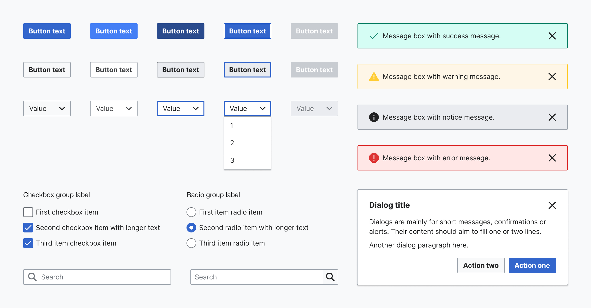
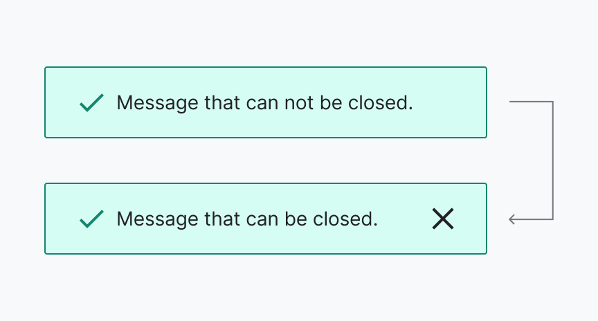
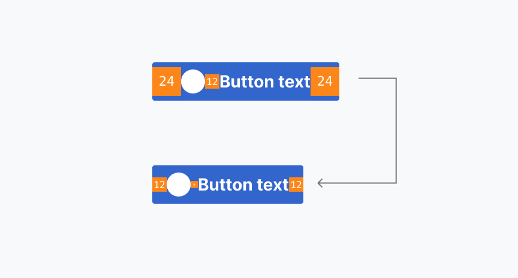
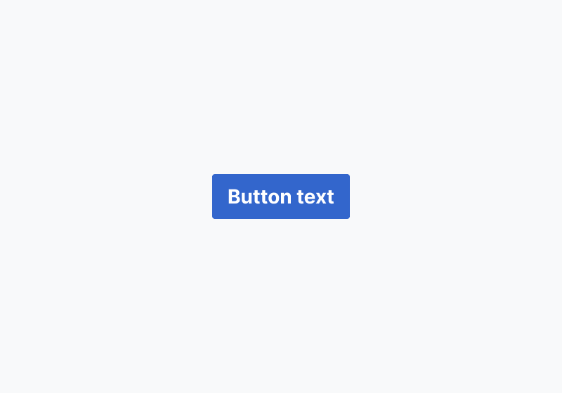
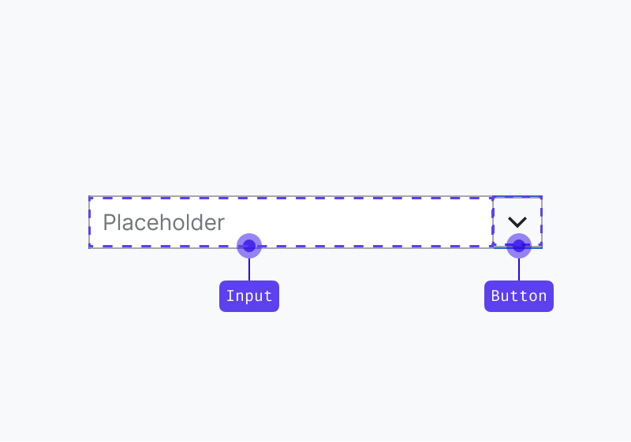
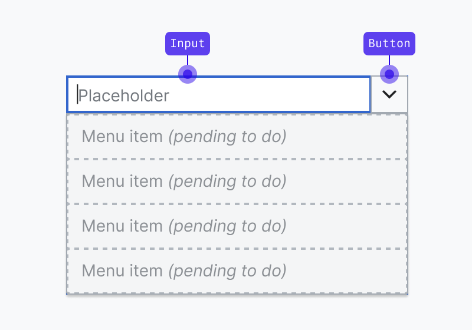
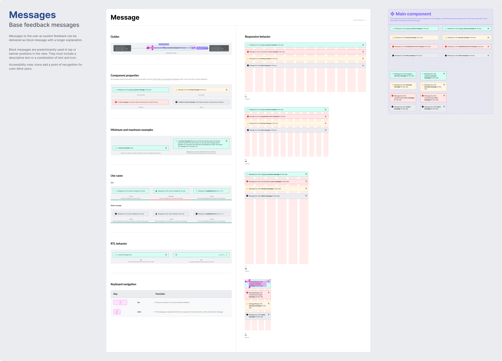
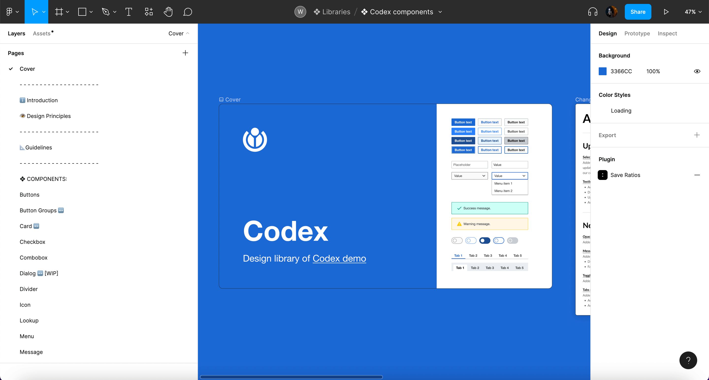

# Redesigning existing components

This page outlines the steps that collaborators should follow to contribute to the redesign of an existing Codex component.

## 1. Report and validate

### 1.1. Define the purpose and scope of this redesign

The redesign of a component should be clearly justified and scoped. There are several scenarios that can motivate the need to redesign a particular component:

**1. A new component variant or property is required**

In this scenario, we may need to create a new component variant or property in order to expand the use cases of the original component (e.g. Message component needs to present a close button so users can dismiss it).

**2. The component’s visual style needs to be updated**

In this scenario, we may need to change the visual style of the component in order to improve it, or to make it consistent with other system elements (e.g. Button paddings need to be decreased).

**3. The component’s behavior needs to be improved**

We may want to update the component behaviors for well-justified reasons to improve user-experience (e.g. allow the component to grow in height to accommodate longer text).

### 1.2. Create a new Phabricator task

Once the purpose of the component redesign has been defined, a new Phabricator task will need to be created. Use this [component task template][component-task-template] to create the new ticket. Fill in as much information as possible in the predefined sections.

### 1.3. Review the task with the Design Systems Team

The new task must be reviewed with the Design Systems Team (DST) before the design process starts. This will generate understanding of the new use case and effectively validate that this component update is needed. Make sure to add the [Design-Systems-Team](https://phabricator.wikimedia.org/project/profile/5858/) project tag in the task for visibility. You can also post a comment once the task has been created and ping the DST members to start the conversation.

Once the task is validated with the DST and the need to update the component is clear, you can start designing the updated system component.

## 2. Research and prepare

The designer should start by checking the following resources in order to collect relevant information about the existing component and its current use cases:

- [Codex component demos](../components/overview.md) and [Codex components Figma library](https://www.figma.com/file/KoDuJMadWBXtsOtzGS4134/%E2%9D%96-Codex-components?node-id=1891%3A4420): check the current component behaviors and interactions.
- [Wikimedia web products](https://www.wikimedia.org/): study the current component use cases in the different Wikimedia products.

Designers should start by analyzing the current component in production and collecting relevant current use cases. This initial inventory-like process will allow designers to understand the component, and to make sure that the new version matches existing production patterns.

Designers should also compare components of the same category or elements with shared characteristics that can influence the design direction.

## 3. Redesign the component

### 3.1. Create a new exploration file

Create a new Figma file to explore the different proposals and versions of the new component, so you can share them in the Phabricator task. You can duplicate this [component exploration template](https://www.figma.com/file/6hNSvvL4CoyfemXECihJD5/Exploration-File-(Template)?node-id=1%3A3627) to create your own file. You can also copy the existing main component and its spec sheet from the [Codex components library](https://www.figma.com/file/KoDuJMadWBXtsOtzGS4134/%E2%9D%96-Codex-components?node-id=1891%3A4420&viewport=262%2C301%2C0.2) into your exploration file: this way, you won’t need to start the component specification sheet from scratch.

The following information will be included in the design exploration file:

- **Cover:** contains a title, description, Phabricator task link and the task owner.
- **Inventory** *(optional):* to collect and analyze the current use cases where the existing component is being used.
- **Component specifications**: this [spec sheet template](https://www.figma.com/file/6hNSvvL4CoyfemXECihJD5/Component-spec-sheet-(exploration-file-template)?node-id=501%3A22874&viewport=532%2C205%2C0.12) should be used to collect the most relevant component specifications, from visual guides to use cases and RTL version. As commented above, you can create this spec sheet from scratch or copy the one from [Codex components library](https://www.figma.com/file/KoDuJMadWBXtsOtzGS4134/%E2%9D%96-Codex-components?node-id=1891%3A4420&viewport=262%2C301%2C0.2) into your exploration file in order to build on top of it.
- **Versioning:** Create a new Figma page for every new version of the component specifications. Indicate the version (e.g. “v1”) and date (e.g. “2022-07-17”) and add an icon to indicate if the version is the final (✅), archived (📁) or WIP (🛠).

### 3.2. Defining visual styles and interaction

The research phase should allow designers to identify the component’s behavior and its building blocks. The information collected during that period should then be used to support the redefinition of the missing visual and interactive characteristics of said component.

#### Defining the component’s building blocks

It is essential to identify the component’s architecture before diving deeper into defining its new style and functionality. What are the building blocks or smaller elements that build up the component? Are these smaller elements components too? The answer to these questions can generate three scenarios:

1. The component we are redesigning is not built as a composite of different components (e.g. Button), so we’ll update a single element.

2. The component we are redesigning is built as a composite of different components that already exist (e.g. Combobox, which combines an input and a button). So we’ll consider how the changes affect each one of the component’s building blocks.

3. The component we are redesigning is built as a composite of different components and **one or more don’t exist** (e.g. Combobox, which combines an input and a button that already exist but needs the menu items to select one option in the dropdown menu)

::: warning
This scenario will require you to follow the same design process outlined in the [“Designing new components”](./designing-new-components.md) section to **create each one of the missing components**. Each new Codex component will require a **dedicated component task** and will have its own design spec sheet.
:::

#### Defining the component’s visual style

All system components should follow the visual guidelines defined in our [style guide](../style-guide/overview.html), as reflected by our design tokens, and use system iconography.

Some resources you can check to find Codex tokens and assets:

- **Design Tokens:** [Figma library](https://www.figma.com/file/mRvSsFD2Kwh8AZNjlx7rIl/%E2%9C%A8-Design-Tokens-%5BWIP%5D?node-id=0%3A1) | [Codex demo](../design-tokens/overview.html)
- **Icons:** [Figma library](https://www.figma.com/file/1lT9LKOK6wiHLnpraMjP3E/%E2%9D%96-Icon-System) | [Codex demo](../icons/all-icons.html)
- **Other assets** (logos and illustrations): [Figma library](https://www.figma.com/file/1lT9LKOK6wiHLnpraMjP3E/%E2%9D%96-Icon-System)

::: warning
You will need to enable both the [Design Tokens](https://www.figma.com/file/mRvSsFD2Kwh8AZNjlx7rIl/%E2%9C%A8-Design-Tokens-%5BWIP%5D?node-id=0%3A1&viewport=466%2C353%2C0.07) and [Icon System](https://www.figma.com/file/1lT9LKOK6wiHLnpraMjP3E/%E2%9D%96-Icon-System) libraries in your Figma exploration file in order to have access to the system’s styles and icons. Learn more about [how to access libraries](https://help.figma.com/hc/en-us/articles/360038743434#access) in Figma.
:::

Design tokens can help support the visual definition of components, as they represent pre-made, systematic stylistic decisions applied to specific properties. While designing system components, remember to:

- Only use colors from the [**color decisions**](https://www.figma.com/file/mRvSsFD2Kwh8AZNjlx7rIl/%E2%9C%A8-Design-Tokens-%5BWIP%5D?node-id=902%3A3415&t=vLBtIEtZXpfb8dlA-11) defined in our system, and only apply them in their specific context of use (e.g. use only border colors to style borders). If you need to use a color that is not documented in the color decisions’ palette, or you need to apply it in a different context of use, please notify the Design Systems Team.
- Only use system [**text/font styles**](https://www.figma.com/file/mRvSsFD2Kwh8AZNjlx7rIl/%E2%9C%A8-Design-Tokens-%5BWIP%5D?node-id=1%3A3484).
- Follow the [**size & spacing**](https://www.figma.com/file/mRvSsFD2Kwh8AZNjlx7rIl/%E2%9C%A8-Design-Tokens-%5BWIP%5D?node-id=1%3A3487) to define the **spacing** (e.g. paddings & margins) and **size** (e.g. heights & widths) of components and their elements.
- Use the [**grid & layout**](https://www.figma.com/file/mRvSsFD2Kwh8AZNjlx7rIl/%E2%9C%A8-Design-Tokens-%5BWIP%5D?node-id=2%3A2410) defined in our system, and provide responsive versions of the component adjusted to said grids in the component specification sheet.
- If you need to apply shadows in your design, use only the [**shadow styles**](https://www.figma.com/file/mRvSsFD2Kwh8AZNjlx7rIl/%E2%9C%A8-Design-Tokens-%5BWIP%5D?node-id=1%3A3485) created in our system and documented as "effect styles" in Figma.
- Always use the same [**border radius, width and style**](https://www.figma.com/file/mRvSsFD2Kwh8AZNjlx7rIl/%E2%9C%A8-Design-Tokens-%5BWIP%5D?node-id=1%3A3482) defined in our tokens

Furthermore, components will need to consume only system assets:

- If you need to use iconography in your designs, use a [system icon](https://www.figma.com/file/1lT9LKOK6wiHLnpraMjP3E/%E2%9D%96-Icon-System?node-id=0%3A1). If you need to use an icon that does not exist in our shared library yet, you can contribute the design of a new icon. (Learn how to do this in the [Designing icons](./designing-icons.md) section).
- If you need to use a Wikimedia logo, please use one from our [logo assets](https://www.figma.com/file/1lT9LKOK6wiHLnpraMjP3E/%E2%9D%96-Assets-(Icons%2C-Logos%2C-Illustrations)?node-id=2285%3A3747&viewport=993%2C62%2C0.32).
- If you need to use an illustration, please use one from our [illustration assets](https://www.figma.com/file/1lT9LKOK6wiHLnpraMjP3E/%E2%9D%96-Assets-(Icons%2C-Logos%2C-Illustrations)?node-id=3232%3A669&viewport=1267%2C-111%2C0.1) or create one with the same styles.

#### Defining the component's interaction

In order to provide a consistent experience, the component’s (new) behavior and interactive states should also follow the system’s design principles and patterns specified in the [Codex library](https://www.figma.com/file/KoDuJMadWBXtsOtzGS4134/%E2%9D%96-Codex-components?node-id=1891%3A4420https://www.figma.com/file/KoDuJMadWBXtsOtzGS4134/%E2%9D%96-Codex-components?node-id=1891%3A4420).

When applying design changes to components, remember to:

- Consider **internationalization** needs and make sure that the component remains optimized for the different languages and orientations (learn more about [designing for bi-directionality](https://www.figma.com/file/KoDuJMadWBXtsOtzGS4134/%E2%9D%96-Codex-components?node-id=3149%3A46886)).
- Make sure to define the **responsive behavior** of the new version of the component, and to provide examples of its adaptation to different devices/ screen sizes. You should define the component for desktop, tablet landscape, tablet portrait and mobile.
- Research and follow **accessibility** best practices that apply to the typology of the component being defined, and provide keyboard navigation specs if needed for this new version. Read more about [accessibility principles and resources](https://design.wikimedia.org/style-guide/design-principles_accessibility.html).

### 3.3. Redesign the main component in Figma

Once the new visual and/or interactive traits of the component are well defined, you’ll be ready to redesign the [main component](https://help.figma.com/hc/en-us/articles/360038662654-Guide-to-components-in-Figma) in the Figma exploration file. This will make it possible for other designers to reuse the new version of the component in different Figma projects.

Depending on the scope of the change, you might need to:

- Create the [Figma variants](https://help.figma.com/hc/en-us/articles/360056440594-Create-and-use-variants): to represent new potential states (default, hover, focus, disabled…) of the component in all platforms (desktop, mobile).
- Define new [component properties](https://help.figma.com/hc/en-us/articles/5579474826519-Create-and-use-component-properties) (these apply to all variants) so the designers can customize the variant and showcase new elements or functionality (e.g. an icon, a new close button), to adjust the component to their use case.
- Apply the right [auto layout](https://help.figma.com/hc/en-us/articles/5731482952599-Using-auto-layout) properties to make sure the component keeps displaying the right resizing behavior and maintains the correct spacing whenever its contents are modified.
- If needed, apply [constraints](https://help.figma.com/hc/en-us/articles/360039957734-Apply-constraints-to-define-how-layers-resize) to define how the component will behave when resized.

Figma provides extensive [resources](https://help.figma.com/hc/en-us) that will help you create flexible and robust components that are reliable and comfortable to reuse by the rest of the design team members. Count on the Design Systems Team to support you at any step of the process if you find any obstacles working with Figma.

### 3.4. Create the component’s specification sheet

Once the main Figma component has been updated with the new visual style and interaction, the spec sheet will need to be edited in order to reflect the latest version. As mentioned, you can copy and update the current specs available in the [Codex components library](https://www.figma.com/file/KoDuJMadWBXtsOtzGS4134/%E2%9D%96-Codex-components?node-id=1891%3A4420&viewport=262%2C301%2C0.2).

Make sure to review and update all the relevant sections of the spec sheet that need to reflect the new visual style or behavior of the component. If needed, new sections or subsections can be added to the spec sheet.

### 3.5. Evaluate and iterate

#### Collecting design feedback

Throughout the component design process, it is important to incorporate feedback from Wikimedia’s UX designers, specially from system designers, who will also grant final explicit approval on their proposed design and its specification before moving into the hand-off to development step.

Once the component’s specification sheet has been updated in the design exploration file, it should be shared in the Phabricator task in order to collect feedback from the Design Systems Team, other designers, and community members. 

The component redesign proposal will be discussed in Phabricator, and it will be iterated on if needed. All the open questions listed in the task and subsequent possible discussions will need to be solved before the component’s design process can be considered done.

::: warning
No component updates or variants can be added to the system without being validated by the Design Systems Team first. The component designs will need to be reviewed with help from a system designer from the core team. Post a comment in the Phabricator task and ping them there so they can review the component and track the task.
:::

#### Collecting feedback from users

You can assess the need to test the new version of the component with help from users using your preferred methodology. This will validate to which degree the new behavior and features meet their expectations, and whether it supports them to accomplish the intended task.

A general recommendation is to test components in a realistic context that simulates the component’s most common interaction conditions: in combination with other components (e.g. test input fields in a form set up, create a search scenario to test search fields, etc.).

## 4. Hand-off to development

Once the component’s new design has been discussed, iterated on (if needed) and finished, the designer will share the link to the final version of the design spec sheet in the relevant component Phabricator task, so developers can start implementing the component in Codex.

The following actions are required:

1. **Link the design spec in the task:** the designer will add the link to the exploration file with the design spec sheet in the description of the Phabricator task.
2. **Explain the proposal and list what’s being updated:** the designer will explain the proposal in the task description and will clearly list all the things we are updating in this new version of the existing component. It’s important that developers know exactly what is changing in order to save time (e.g. if Button paddings are being updated, list all the paddings and values in the task).
3. **Post a comment:** in addition to link the spec sheet, the designer will post a comment explaining that the task is ready to be implemented, pinging the developer in that comment if possible.
4. **Move task in the board:** the designer will move the task to the next relevant column in the board to indicate that the component can be implemented in Codex.
5. **Complete the design checklist:** the designer will complete the design checklist in the “Acceptance criteria” section in the task description to indicate which steps in the task were already completed.

We recommend reviewing the component’s interactive and visual specs with the help from the developers that will tackle its implementation as part of the hand-off step.

Engineers can help detect edge cases and identify potential technological constraints that should be considered during the design process.

## 5. Design sign-off

Once the component has been fully implemented in Codex, developers will assign the task to the component’s designer (and move the task to the corresponding column if existent) to perform a complete design review of the component.

The component will need to be tested against all its visual and functional specifications: states, properties, minimum and maximum examples, responsiveness, LTR and RTL, etc.

Once the design sign-off has been done, the designer will assign it to QTE and move it to the corresponding QTE sign-off column, so quality assurance testing can be performed as a final check before release.

::: info
Designers will be able to check how components are coming along during the implementation process by accessing the Codex demo page staged in Netlify. Developers can provide links to the relevant Netlify build for you to provide feedback.
:::

## 6. Document: Add the updated component to the Figma library

Once the new version of the component has been implemented and signed-off, it will be ready to be added to the [Codex components Figma library](https://www.figma.com/file/KoDuJMadWBXtsOtzGS4134/%E2%9D%96-Codex-components) so that it can be reused in the different design projects.

::: info
In order to avoid problems with current components and instances, system designers will be responsible for adding new components to the library and publish it. Please ping them in the component’s Phabricator task and share the design exploration file with them so they can add the component to the [library](https://www.figma.com/file/KoDuJMadWBXtsOtzGS4134/%E2%9D%96-Codex-components?node-id=1891%3A4420).
:::

[component-task-template]: https://phabricator.wikimedia.org/maniphest/task/edit/form/1/?title=Update%20%5BComponentName%5D%20component%20in%20Codex&description=%23%23%20Background%0D%0A%0D%0ANOTE%3A%20%2F%2FWhen%20creating%20a%20component%20task%2C%20please%20try%20to%20fill%20out%20the%20entire%20Background%20section.%20The%20rest%20of%20the%20task%20description%20can%20be%20populated%20later.%2F%2F%0D%0A%0D%0A-%20**Description%3A**%20%2F%2Fadd%20a%20brief%20description%20of%20this%20component%2F%2F%0D%0A-%20**History%3A**%20%2F%2Fdescribe%20or%20link%20to%20prior%20discussions%20related%20to%20this%20component%2F%2F%0D%0A-%20**Known%20use%20case(s)%3A**%20%2F%2Fdescribe%20known%20use%20cases%20for%20this%20component%2C%20including%20the%20project%2C%20team%2C%20and%20timeline%2F%2F%0D%0A-%20**Considerations%3A**%20%2F%2Flist%20any%20known%20challenges%20or%20blockers%2C%20or%20any%20other%20important%20information%2F%2F%0D%0A%0D%0A%23%23%23%20User%20stories%0D%0A%0D%0A%2F%2Fadd%20at%20least%20one%20user%20story%2F%2F%0D%0A%0D%0A%23%23%23%20Previous%20implementations%0D%0A%0D%0A-%20**Codex%20demo%3A**%20%2F%2Fadd%20%5B%5B%20https%3A%2F%2Fdoc.wikimedia.org%2Fcodex%2Flatest%2Fcomponents%2Foverview.html%20%7C%20Codex%20demo%20%5D%5D%20current%20component%20link%2F%2F%0D%0A-%20**Design%20style%20guide%3A**%20%2F%2Fadd%20%5B%5B%20https%3A%2F%2Fdesign.wikimedia.org%2Fstyle-guide%2Findex.html%20%7C%20Design%20Style%20Guide%20%5D%5D%20link%2C%20if%20applicable%2F%2F%0D%0A-%20**OOUI%3A**%20%2F%2Fadd%20the%20relevant%20OOUI%20widget%20name%20here%2C%20if%20applicable.%20See%20%5B%5B%20https%3A%2F%2Fdoc.wikimedia.org%2Foojs-ui%2Fmaster%2Fdemos%2F%3Fpage%3Dwidgets%26theme%3Dwikimediaui%26direction%3Dltr%26platform%3Ddesktop%20%7C%20OOUI%20demos%20%5D%5D.%2F%2F%0D%0A-%20**Vue%3A**%20%2F%2Fadd%20any%20existing%20Vue%20implementations%2C%20if%20applicable.%20See%20%5B%5B%20https%3A%2F%2Fphabricator.wikimedia.org%2FT272885%20%7C%20Vue%20component%20inventory%20%5D%5D.%2F%2F%0D%0A%0D%0A%23%23%23%20Design%20spec%0D%0A%0D%0A%2F%2F%20Once%20a%20component%20spec%20sheet%20has%20been%20created%20in%20Figma%2C%20remove%20the%20note%20stating%20that%20the%20spec%20is%20missing%20and%20link%20to%20the%20spec%20below.%20%2F%2F%0D%0A%0D%0A%7C%20Component%20spec%20sheet%20%7C%0D%0A%0D%0A%23%23%23%20Open%20questions%0D%0A%0D%0A%2F%2F%20Add%20here%20the%20questions%20to%20be%20answered%20in%20order%20to%20design%20and%20implement%20the%20component%20%2F%2F%0D%0A%0D%0A%23%23%23%20Acceptance%20criteria%20(or%20Done)%0D%0A%0D%0A**Design**%0D%0A%5B%5D%20Design%20the%20Figma%20spec%20sheet%20and%20add%20it%20in%20this%20task%0D%0A%5B%5D%20Update%20the%20component%20in%20the%20Figma%20%5B%5B%20https%3A%2F%2Fwww.figma.com%2Ffile%2FKoDuJMadWBXtsOtzGS4134%2F%E2%9D%96-Codex-components%3Fnode-id%3D1891%253A4420%26viewport%3D287%252C338%252C0.28%20%7C%20library%20%5D%5D.%20%2F%2FThis%20step%20will%20be%20done%20by%20a%20DST%20member.%2F%2F%0D%0A%0D%0A**Code**%0D%0A%5B%5D%20Implement%20the%20component%20in%20Codex&projects=Design-Systems-Team%2C%20Codex
