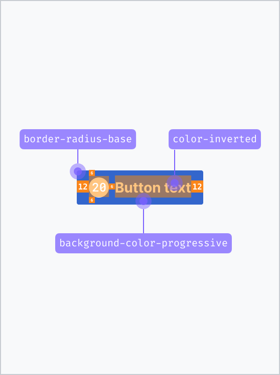
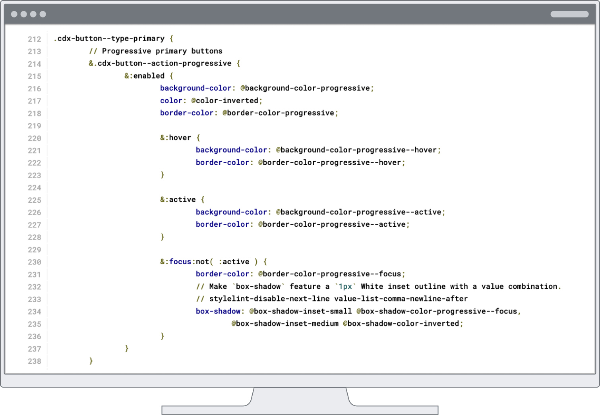

# Definition and Structure

## 1. What are design tokens?

Design tokens are the smallest units that store the visual guidelines and design decisions that characterize our system. More importantly, tokens document the intended context of use assigned to a specific style, and enable the application of the correct visual value to a specific component property. This is how tokens help to bridge the gap between implementation and design.

Tokens are used to:

1. **Define the visual style of components**: since tokens capture the system’s stylistic
attributes, they provide guidance to define the styles (background colors, text
formatting, sizes, spacing…) of new system components from scratch.

2. **Codify design styles**: Designers use tokens to specify all the visual styles and interactive
properties of a given component. These design decisions are translated to code. For more details
regarding the use of design tokens for design specification, please refer to the section dedicated
to specification hand-off to development in the [Designing Components](../contributing/designing-new-components.md) documentation.

### From visual styles to tokens in design and code
Design system components are made up of a combination of predefined perceptual patterns. These patterns result from the consistent application of preselected styles such as colors, shadows, or spacing values, to specific UI elements and properties like backgrounds, borders, or paddings.

At its core, Codex is made up of a set of visual styles derived from the [style guide](../style-guide/overview) principles. Colors, typography, shadows and spacings are aligned with the style guide, and documented as tokens in the system. Design tokens are thus the smallest building blocks of the system: they define, document and enable the application of systemic design decisions at scale.

### Token typologies

There are three types of tokens, depending on their function and level of abstraction:

#### Option tokens (aka theme options)
Option tokens are context-agnostic tokens that encapsulate the primitive visual foundations of the system. Their name does not reflect a specific use case, rather they use the simplest possible name. They have raw values, e.g. `color-blue500: #447ff5`

Option tokens are not used to style components. Their only purpose is to document raw values, and to be consumed by the next token typology: decision tokens.

Option tokens are captured in the theme specific JSON file: `theme-wikimedia-ui.json`

#### Decision tokens

Decision tokens consume option tokens as values. They represent design decisions that can be reused to style system components. For this reason, decision tokens are documented in our [Codex token demo](./color.md). They communicate their intended use case via their name (so are not agnostic, like option tokens), e.g. `box-shadow-drop-medium: box-shadow.200;`.

Decision tokens are used to style system components and elements. This set of tokens is documented in the JSON file `codex-base.json`.

#### Component decision tokens
In the context of Codex, component tokens are used to document and define specific component styles that cannot be documented as shared decisions due to their single-use application. The names of component tokens include the name of the specific component and the property they define. Like decision tokens, they consume option tokens as values, e.g. `color-link-red--visited: color.maroon`.

Component tokens embody exceptions, and are directly applied to style specific component properties. If a pattern arises (i.e. the component token can be used by several components), the  single-use component token can be converted into a decision token.

Component tokens are documented in the JSON file `codex-components.json`.

## 2. Tokens in design

### From design to implementation
Designers can access an overview of Codex’s foundational styles and principles and their corresponding token translation in the [Design Tokens library](https://www.figma.com/file/mRvSsFD2Kwh8AZNjlx7rIl/✨-Design-Tokens-[WIP]?node-id=1%3A119) in Figma. By enabling the Design tokens library in their project’s Figma files, designers will be able to reuse the system’s visual principles as Figma styles when creating components and compositions.

::: info
Please note that tokens are context-specific: use them accordingly to the intended purpose expressed by their name. E.g. Apply content colors only to text.
:::

During implementation, engineers will be able to follow the design specifications in Figma (whether these are presented explicitly, or via the Inspect panel) and use the correct design tokens as values of the component’s CSS properties.

Please find all current design system token category demos in this Design Tokens section of Codex, starting at [Animation](animation.md) and ending at [Z-Index](z-index.md).

## 3. Tokens in code
### File organization
Codex token files are structured to cater to Wikimedia's multi-theme environment. Base tokens apply
the theme-agnostic named tokens from 'theme-*' JSON files across components and patterns. Single
component tokens also apply theme-agnostic named tokens.

1. **Theme tokens ('theme-*.json' files): Design options** 
Themes are defined in JSON files with theme-agnostic keys and theme-specific values.
Theme tokens are not meant to ever be directly applied in Codex stylesheet rules for components or
patterns. They are only the internal pool of design options for the decisions represented by base
and component tokens.

2. **Base tokens ('codex-base.json'): Design decisions** 
The base tokens 'codex-base.json' file and the component tokens 'codex-components.json' file are
featuring the design decisions. All token keys follow a more semantic, developer-friendly naming
scheme, where values from the design options token pool above are applied into decisions. Base
tokens are used across various components.

3. **Component tokens ('codex-components.json'): Design decisions** 
The component tokens 'codex-components.json' file collects only single-component design decisions,
that are not covered by the base tokens. All component tokens carry the single-file-component name
in their name after the token category, for example `background-color-button-quiet--hover`. 
Important reasons for separating component from base tokens are to support identifying consistency
gaps and emerging design patterns across components or to surface very close values for
combination later.

### Naming and definition structure
To create an extensible structure that is easily understood by humans, we follow these rules when
naming tokens:

- The JSON keys follow CSS property names for the sake of familiarity and readability. They follow
by and large [variable naming patterns established for MediaWiki](https://www.mediawiki.org/wiki/Manual:Coding_conventions/CSS#Variable_naming). For example, we use `{ font-weight.100 }`
instead of `{ font.weight.100 }`. There are a few category naming exceptions like `size` and
`spacing` tokens, in order to reuse them in different property contexts – as values in `width`,
`height`, `padding` and so on.
  - The name describing the CSS property or category value always comes first, which makes it obvious
when a token is improperly applied to a different property, e.g. ~~`color: @background-color-base`~~.
- Tokens with numerical values are centered around a default key of `100`. This is critical to
creating a structure that is flexible and theme-agnostic. For example, base size is defined by
`{ dimension.100 }`, which could be used to define a default theme base font size of
`16px`, or a theme-specific base font size of `14px`, depending on what theme the size token is set
to. Because the names of the design tokens do not refer to a specific value, they can be reused by
both the default and other themes.

### Further technical notes
- Note, that normalization and reset values like `0` or `none` are not tokenized as they aren't used
for design decisions. 
`box-shadow: none` or `z-index: 0` on the other hand are representing design decisions.
- We're not using [Style Dictionary's predefined transform groups](https://github.com/amzn/style-dictionary/blob/main/docs/transform_groups.md) for all stylesheet formats (CSS, Less
and Sass) in order to keep precise control over output. For cross-browser support, we rely on a
variety of output values for different applications (example: `transparent` over 'color/css' output
hexadecimal color `#00000000`) and also deliver small performance gems like hex color shorthands.
