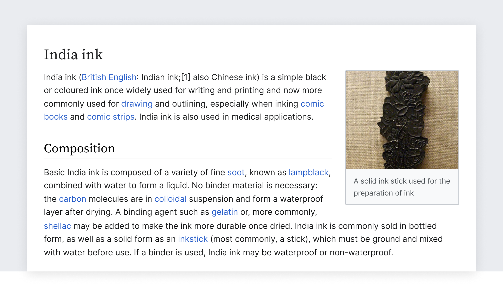
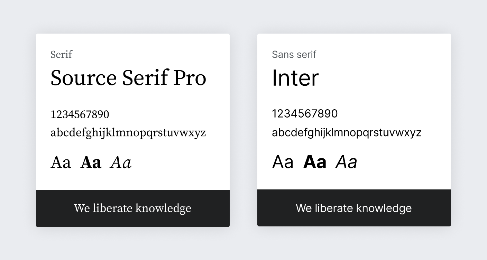

# Typography

Wikimedia projects rely on writing and reading. Typography is a key component of their design.
Consider the typeface, size, style, and spacing of your text to achieve good [readability](https://en.wikipedia.org/wiki/Readability).
Our typographic choices make our content accessible, present it in a neutral way, and convey its
reliability.



## Readability

Content should be readable by everyone, regardless of their circumstances. Color blindness or the sun on a device's screen should not be barriers to access.

### Contrast

When using text, make sure that it provides enough color contrast to be read comfortably. Check the
contrast between the colors used for the text and its background. Accessibility note: Provide at
least level AA sufficient contrast (4.5:1). The [color palette](./colors) provides the contrast
levels for pure white and black surfaces, but you need to ensure the contrast of other combinations.

<div class="cdx-docs-contrast">
	<div class="cdx-docs-contrast__demo cdx-docs-contrast__demo--do">
		<div class="cdx-docs-contrast__demo__text">
			Bento (弁当 bentō) is a single-portion take-out or home-packed meal common in Japanese cuisine.
		</div>
		<span class="cdx-docs-contrast__demo__info">
			<strong class="cdx-docs-do">Do:</strong> Contrast against the background
		</span>
	</div>
	<div class="cdx-docs-contrast__demo cdx-docs-contrast__demo--dont">
		<div class="cdx-docs-contrast__demo__text">
			Bento (弁当 bentō) is a single-portion take-out or home-packed meal common in Japanese cuisine.
		</div>
		<span class="cdx-docs-contrast__demo__info">
			<strong class="cdx-docs-dont">Don't:</strong> Low contrast below 4.5:1, especially at smaller sizes, makes text harder to read.
		</span>
	</div>
</div>

### Tracking and leading

**Text spacing:** How text is placed in space can affect its readability. Follow these considerations for text paragraphs:
- Line length for reading in English is ideally no longer than [75 characters](https://en.wikipedia.org/wiki/The_Elements_of_Typographic_Style).
- Line height should be 1.6 times the size of the font used. Internationalization note: Use a
  bigger line height in a relative size unit like rem or em, not in an absolute like px, to prevent
  clipping of some Indic scripts, for example Burmese.

### Dynamic text

Content will be available in multiple languages, and text length will vary for pieces of content across languages. Avoid designing interfaces that depend on certain expectations about text length.

<figure>
	
	<figcaption>Text shown at different font sizes depending on its length.</figcaption>
</figure>

Here are few ways to tackle dynamic text:
- **Uncrowded user interface.** Design with an eye for simplicity. Consider reducing the number of
  elements to ensure the remaining ones have enough room.
- **Dynamic layout.** Make containers expandable, so that they can fit the content.
- **Dynamic text.** Adjust the size depending on the content. Use a smaller font-size for long
  content.
- **Clipping.** Clip the text with an ellipsis, only if there is no risk of missing important
  information or the complete information is reachable through a clear alternative means.

## Typefaces

Text can be read in multiple languages on different devices. We recommend using the fonts already
available on each device and operating system. This keeps the experience simple and consistent with
the platform conventions and ensures widest language script support as provided by the operating
systems themselves. The following sections provide a selection criteria for choosing appropriate
typefaces, and how to apply it on different platforms.

### Font selection criteria

To select an appropriate font family for a given language script or device, follow these criteria:
- **Readability.** Fonts with a bigger x-height and open shapes are preferred.
- **Neutral aspect.** The font should work with many different kinds of content without adding a
  particular voice to it.
- **Simple shapes.** Fonts with less complex shapes work better at smaller sizes and on
  low-resolution devices.
- **Open.** Open source fonts are preferred to align with the open knowledge they deliver.

### Platform-specific fonts

We recommend relying on the operating system's default sans-serif typeface.[[1]](#ref1)[[2]](#ref2)

Most platforms have plenty of options for supporting latin-based languages, where the serif concept
makes sense. Among the different serif system fonts we recommend [Source Serif Pro](https://en.wikipedia.org/wiki/Source_Serif?useskin=vector)
(present in many operating systems).

Below you can see an example CSS code to support the default system fonts:

<style>
/* stylelint-disable font-family-name-quotes */
</style>
```css
/**
 * System font stack for sans-serif fonts
 *
 * `-apple-system` ('San Francisco' font) – Support Safari 9+ macOS and iOS, Firefox macOS
 * `BlinkMacSystemFont` ('San Francisco' font) – Chrome 48+ macOS and iOS
 * `Segoe UI` – Windows Vista & newer
 * `Roboto` – Android 4.0+
 * `Inter` – Wikimedia Design choice, OFL licensed
 * `Helvetica, Arial, sans-serif` – (Generic) Web fallback
 *
 * Note that standard `system-ui` value has resulted in unresolved
 * side-effects in certain OS/language combinations as of now and is
 * therefore not included.
 */
font-family: -apple-system, BlinkMacSystemFont, 'Segoe UI', Roboto, Lato, Helvetica, Arial, sans-serif;
```
<style>
/* stylelint-enable font-family-name-quotes */
</style>

Fonts are not always available for all scripts or all operating systems. For example, Helvetica
does not support the Korean script. Using the default font on the user device for Korean text seems
the safest choice, unless there is a better candidate based on the selection criteria described
above, and selected by someone familiar with the script.

### Platform-neutral fonts

In some cases you may be designing in a neutral-platform context. For example, creating mockups to
convey a general interface concept targeting multiple platforms, or contributing to this style
guide. In those cases, it is convenient to select free fonts that follow the above criteria.

We recommend Source Serif Pro and Inter when available in your language, as well as the Noto font
family for extended language support.
- **Source Serif Pro** is a serif typeface created by Frank Grießhammer for Adobe Systems. The
  typeface is inspired by the forms of [Pierre Simon Fournier](https://en.wikipedia.org/wiki/Pierre_Simon_Fournier)
  and is a complementary design to the [Source Sans](https://en.wikipedia.org/wiki/Source_Sans_Pro)
  family.
- **Inter** is a sans-serif typeface family designed for computer screens.
- The [**Noto family**](https://en.wikipedia.org/wiki/Noto_fonts) provides a great coverage of
  languages, providing good alternatives for both serif and sans-serif typefaces.




These fonts are provided as a reference, but you may select other free fonts using similar criteria
when the recommended ones are not available in your context.

## Use of styles

The recommended styles are intended to optimize readability of Wikipedia’s dense encyclopedic
content.

In our guidelines we use scale-independent pixels (sp). They can result in a different number of
actual pixels in the user screen due to screen density or user preferences. A 16 sp text is
rendered as 16 px in a 1x device at standard zoom level, but it becomes 21 px in a 2x device (or
when zoomed 200% on a 1x device).

Common text styles are based on the defined scale to clearly communicate the content hierarchy.
Color hints are guidance for general use case in a light mode theme.


<style>
/* stylelint-disable declaration-property-unit-disallowed-list, scale-unlimited/declaration-strict-value */
</style>
```css
/**
 * System font stack for monospace fonts
 *
 * `Menlo` – macOS 10.6+
 * `Consolas` – Windows Vista & newer
 * `Liberation Mono` – Fedora, Ubuntu, … OFL licensed
 * `'Courier New', monospace` – (Generic) web font fallback
 */
font-family: 'Menlo', 'Consolas', 'Liberation Mono', 'Courier New', monospace;
font-size: 14px; /* 14 sp equivalent */
```
<style>
/* stylelint-enable declaration-property-unit-disallowed-list, scale-unlimited/declaration-strict-value */
</style>

## References

1. <span id="ref1">For a historic reference on the former default platform-specific font families
  choice in 2014, a predecessor of current selection, see [Typography_refresh/Font_choice on MediaWiki](https://www.mediawiki.org/wiki/Typography_refresh/Font_choice)</span>
2. <span id="ref2">Find a selection of background information on fonts in our choice at [Font family stack article on MediaWiki](https://www.mediawiki.org/wiki/Wikimedia_User_Interface/Use_cases/Font_family_stack)</span>

<style lang="less">
@import ( reference ) '@wikimedia/codex-design-tokens/theme-wikimedia-ui.less';

.cdx-docs-contrast {
	@media screen and ( min-width: @min-width-breakpoint-tablet ) {
		display: flex;
		gap: @spacing-12;
	}

	&__demo {
		&__text {
			background-color: @background-color-interactive;
			border-bottom-width: @spacing-25;
			border-bottom-style: @border-style-base;
			padding: @spacing-200;
		}

		&--do {
			margin-bottom: @spacing-100;

			@media screen and ( min-width: @min-width-breakpoint-tablet ) {
				margin-bottom: 0;
			}

			.cdx-docs-contrast__demo__text {
				border-bottom-color: @color-success;
			}
		}

		&--dont {
			.cdx-docs-contrast__demo__text {
				// Our design tokens are so good we don't even have a @color token that's bad
				// enough for this example.
				/* stylelint-disable-next-line scale-unlimited/declaration-strict-value */
				color: #a2a9b1;
				border-bottom-color: @color-error;
			}
		}
	}
}
</style>