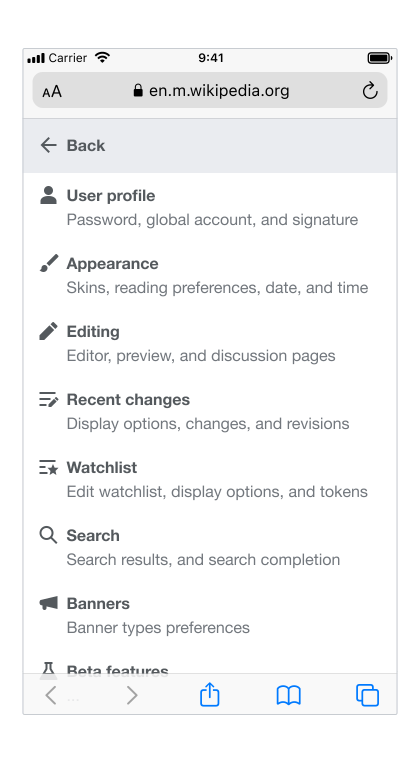
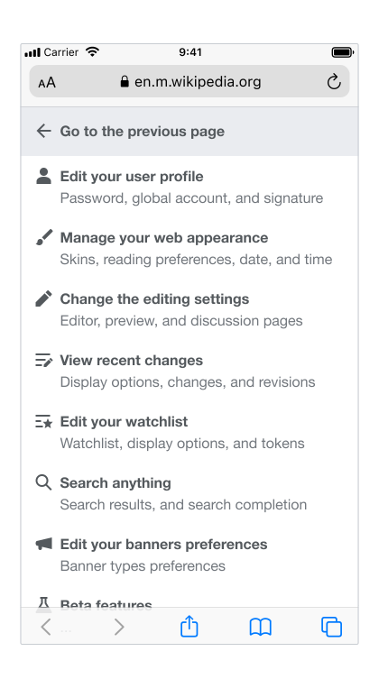
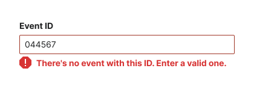
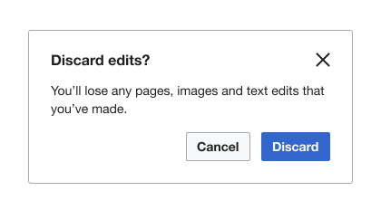
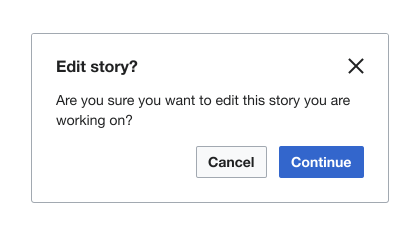
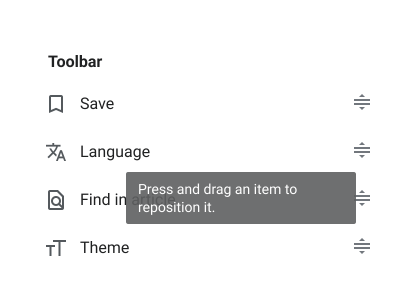
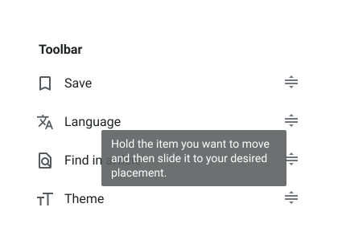
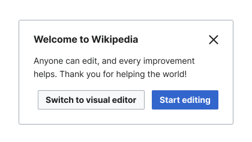
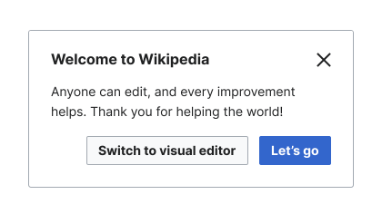
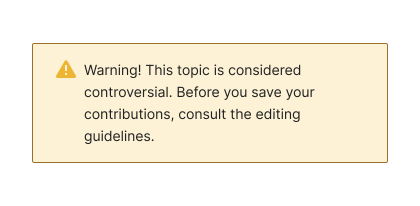

# Writing for copy

Written content should help people learn and understand how Wikimedia products work, as well convey the brand voice. These guidelines were created to help with writing with Wikimedia design principles in mind.

## Introduction

### Content is aligned with our principles

To ensure your user-interface (UI) copy follows our overarching [Wikimedia Design Principles](./design-principles-overview.html), you should consider the following key questions.

**Content first**
- Is this needed?
- Is this relevant?

**Design for consistency**
- Is this clear?
- Is this concise?
- Is this consistent?

**This is for everyone**
- Is this accessible?
- Is this inclusive?
- Is this translatable?

**Trustworthy yet joyful**
- Is this trustworthy?

## Content first

### Is this needed?

Users read a lot of content every day, so don’t use more content than necessary. This will help the reader trust that the content in the UI is useful and it will reduce the user’s frustration.

<cdx-demo-rules>
<template #do-media>

</template>
<template #do-text>

- A minimally textual UI should be tested to check if users can understand what to do.

</template>
<template #dont-media>

</template>
<template #dont-text>

- Avoid using long text to explain concepts that could be solved with short text.

</template>
</cdx-demo-rules>

### Is this relevant?

Content should be relevant to what is being presented, so that the user is easily able to understand what is happening, what needs to be done, and how to accomplish it.

<cdx-demo-rules>
<template #do-media>

</template>
<template #do-text>

- Provide context, explanations, consequences, and solutions when needed.

</template>
<template #dont-media>

</template>
<template #dont-text>

- Request feedback without providing context and a reason for asking.
- Give an error message without providing an explanation and a solution.

</template>
</cdx-demo-rules>

## Design for consistency

### Is this clear?

Communicating clearly helps ease user understanding and gives them confidence that they can make the right choice in order to achieve their goal. For clarity, it’s important to consider not only what the text says, but also how it looks.

<cdx-demo-rules>
<template #do-media>

</template>
<template #do-text>

- Use the same terminology in the title and the CTA.
- Group related content together.
- Consider how the text looks, as well as what it says.

</template>
<template #dont-media>

</template>
<template #dont-text>

- Add additional information or questions or use inconsistent terminology.

</template>
</cdx-demo-rules>

### Is this concise?

Keeping messages as short and simple as possible helps to make them easier to scan and understand. Use [Plain English](https://en.wikipedia.org/wiki/Plain_English) as much as possible, with short, easy-to-understand words and simple phrases. This will also aid in localization.

<cdx-demo-rules>
<template #do-media>

</template>
<template #do-text>

- Keep messages short so they will fit on a small screen.
- Focus on the user’s action.

</template>
<template #dont-media>

</template>
<template #dont-text>

- Give any more information than needed.
- Focus on the user's motivation.
- Provide too many CTAs.

</template>
</cdx-demo-rules>

### Is this consistent?

Consistency is important for reducing cognitive load and prevents a reader from becoming confused when reading text. The language used in the UI should be as consistent as possible with terminology used across other Wikimedia projects and with the [brand voice](https://meta.wikimedia.org/wiki/Brand).

<cdx-demo-rules>
<template #do-media>

</template>
<template #do-text>

- Use a language consistent with the Wikimedia brand.
- Use terminology that is simple, direct, and matches the meaning.
- Keep a list of preferred terminology for parts of the UI (e.g. buttons, tabs).

</template>
<template #dont-media>

</template>
<template #dont-text>

- Use complex terminology.
- Use inconsistent words when they are related.

</template>
</cdx-demo-rules>

## This is for everyone

### Is this accessible?

The content in a UI should be for everyone, no matter their background, language, culture, ability, or identity. Write UX content to be accessible to everyone, whether they have a temporary or permanent disability, and whether they are using assistive tech.

<cdx-demo-rules>
<template #do-media>

</template>
<template #do-text>

- Use alternatives for words that reinforce stereotypes.

</template>
<template #dont-media>

</template>
<template #dont-text>

- Use *enable* or *disable* which implies that disability is a less-desired or negative state. Instead, use *turn on* or *turn off*.
- Use *whitelist* or *blacklist* which have negative racial connotation. Instead, use *allowlist* or *denylist*.
- Use directional descriptors like *below* or *above* as some can not see the page layout.

</template>
</cdx-demo-rules>

*If you are looking for guidance on readability, refer to our [Typography guidelines](./typography.html#readability).*

### Is this inclusive?

Write UX content to be inclusive to everyone, regardless of their background or identity. For guidance on language related to different identities, be sure to consult the [Inclusive Communications Guide](https://office.wikimedia.org/wiki/Inclusive_Communications_Guide).

<cdx-demo-rules>
<template #do-media>

</template>
<template #do-text>

- Use 'a user' or a username when known with a neutral active voice to describe an action that was taken.
- Use ‘they’, ‘you’, or ‘we’ if the gender of the person you’re addressing is unknown and gender is required.

</template>
<template #dont-media>

</template>
<template #dont-text>

- Assume pronouns which are not already defined by said user.

</template>
</cdx-demo-rules>

*Note: Keep in mind that avoiding the use of gender is generally possible in English, but in some languages gender is more difficult to avoid.*

### Is this translatable?

Content is easy to translate when it is written in a clear and simple way. Remember to use [Plain English](https://en.wikipedia.org/wiki/Plain_English), and focus on short, easy-to-understand words and simple phrases, while avoiding idioms and other culturally specific language.

<cdx-demo-rules>
<template #do-media>

</template>
<template #do-text>

- Use easy-to-understand words and simple phrases.

</template>
<template #dont-media>

</template>
<template #dont-text>

- Use idioms, slang, jokes, metaphors, pop culture references, or other culturally specific language.

</template>
</cdx-demo-rules>

*Note: English is the most common language from which content is translated. Keep this in mind when writing clearly and simply.*

## Trustworthy yet joyful

### Is this trustworthy?

When the content is reliable users can achieve their goals with confidence. Consistent overall messaging that is clear and effective also builds trust with a user.

<cdx-demo-rules>
<template #do-media>

</template>
<template #do-text>

- Build trust with the user by providing information in a calm and confident tone.

</template>
<template #dont-media>

</template>
<template #dont-text>

- Cause a reader to panic or worry.

</template>
</cdx-demo-rules>

## Copywriting tips

Check the following list whenever you create new content to make sure your copy is effective and in line with our voice and tone.

- **Use a neutral voice** and focus on the functionality. [Read more about our voice and point of view](./voice-and-tone.html#voice).
- **Use bare infinitives** when referring to an actionable verb such as *Upload*, *Publish*, or *Share*.
- **Adjust tone to reflect the task.** [Learn more about tone](./voice-and-tone.html#tone).
- **Keep things scannable.** Chunk information for easy scanning using bulleted lists, consistent titles, and subtitles.
- **Make consequences clear.** Tell the user what happens when they do something, but don’t overload them with too much information.
- **Give the user their best option(s).** In the case of errors especially, if there is more than one way to correct things, list them in order of effectiveness.
- **Give lists of actions in order.** Give directions clearly by indicating the order of operations. In the case of errors especially, if there is more than one way to correct things, list them in order of effectiveness.
- **Use verbs for actions, nouns for places.** Verbs tell users what to do, like pressing a submit button, while nouns show where they are, such as a user page or preferences tab on a page.
- **Speak the user’s language.** Avoid terms such as “invalid,” “input,” “value” or other phrases rooted in code/development.
    - Instead of “invalid”, use “incorrect”.
    - Instead of “input”, use “content”, “text”, etc.
    - Instead of “value”, use a description of what it is: name, quantity, etc.
- **Choose words carefully.** Repeating *please* and *sorry* too many times can be grating; *just* or *simply* can be frustrating for the user. *Try* implies that a user could fail. Avoid using these words.
    - Instead of “Please try simply refreshing the page to load the data”, use “Refresh the page to load the data”.
- **Work with visual design.** Employ different design resources (colors, grouping, spacing, icons) to create a messaging hierarchy with information blocks.